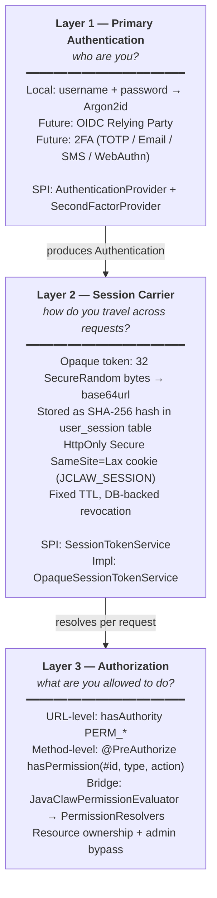
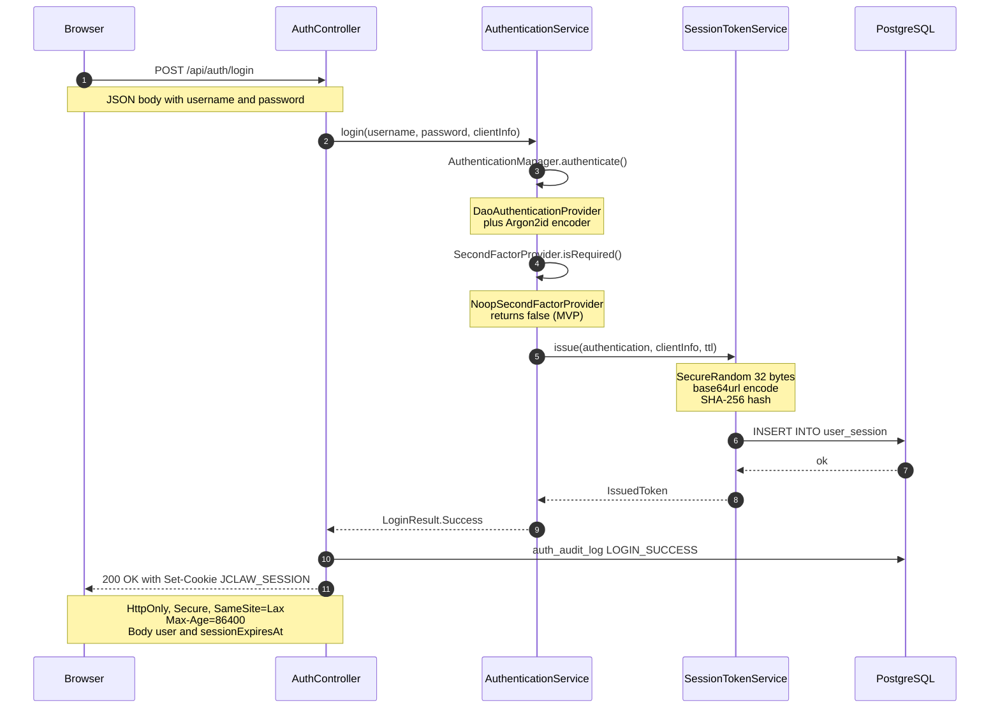
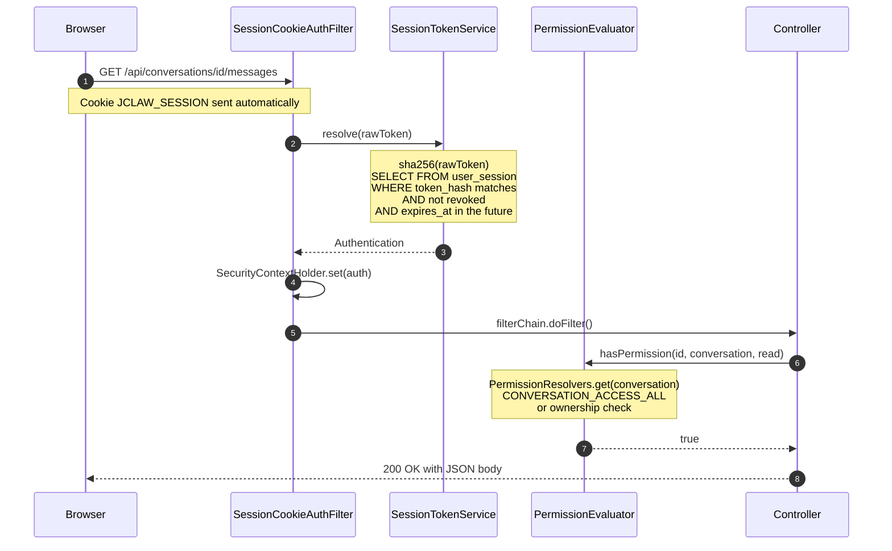

# JavaClaw Security Guide

> **Status:** Cookie-session authentication module, MVP v1 (2026-04-11)<br/>
> **Module:** `javaclaw-security`<br/>
> **Language:** [Русская версия](./security_RU.md)

---

## Table of Contents

1. [Concept](#1-concept)
2. [Architecture](#2-architecture)
3. [Technology Stack](#3-technology-stack)
4. [Authentication Flow](#4-authentication-flow)
5. [Authorization Model](#5-authorization-model)
6. [Database Schema](#6-database-schema)
7. [What's Implemented](#7-whats-implemented)
8. [What's Not Implemented (Roadmap)](#8-whats-not-implemented-roadmap)
9. [Configuration Reference](#9-configuration-reference)
10. [Deployment Checklist](#10-deployment-checklist)
11. [Threat Model](#11-threat-model)
12. [Development & Testing](#12-development--testing)

---

## 1. Concept

JavaClaw uses an **opaque session cookie** authentication scheme over a stateless
Spring Security filter chain. The design is intentionally layered so that
individual components (primary authentication, session carrier, authorization)
can be replaced without rewriting the rest of the system.

**Key invariants:**

- No password or reusable credential is ever stored in the browser.
- The session cookie is `HttpOnly`, `Secure`, `SameSite=Lax` — inaccessible to JavaScript.
- 401 responses from the API **never** carry a `WWW-Authenticate` header —
  the native browser Basic-auth prompt never appears, regardless of which
  request triggered the 401.
- Authorization decisions live in a dedicated `PermissionEvaluator` bridge,
  not scattered across controllers.
- Future auth methods (OIDC Relying Party, TOTP, Email OTP, SMS OTP, WebAuthn)
  plug into the existing SPIs — no breaking changes to API contracts.

---

## 2. Architecture

### 2.1 Three-layer model



### 2.2 Package layout (`javaclaw-security`)

```
ai.javaclaw.security
├── config/
│   ├── SecurityConfig              — SecurityFilterChain, CSRF, STATELESS
│   ├── AuthenticationConfig        — PasswordEncoder, AuthenticationManager
│   ├── MethodSecurityConfig        — @EnableMethodSecurity + PermissionEvaluator
│   ├── SchedulingConfig            — @EnableScheduling
│   ├── SecurityAutoConfiguration   — @EnableConfigurationProperties
│   ├── ApiAuthenticationEntryPoint — 401 without WWW-Authenticate
│   ├── CookieProperties            — @ConfigurationProperties
│   └── SessionProperties           — @ConfigurationProperties
├── session/
│   ├── UserSession                 — Spring Data JDBC entity
│   ├── UserSessionRepository       — CrudRepository
│   ├── SessionTokenService         — SPI
│   ├── OpaqueSessionTokenService   — default implementation
│   ├── SessionCookieAuthFilter     — OncePerRequestFilter
│   ├── SessionCookieWriter         — Set-Cookie builder
│   ├── SessionCleanupJob           — @Scheduled cleanup
│   └── ClientInfo / IssuedToken    — value types
├── authn/
│   ├── AuthenticationService       — login facade
│   ├── JdbcUserDetailsService      — loads users from DB
│   ├── AuthorityMapper             — Permission → GrantedAuthority
│   ├── LoginResult                 — sealed result type
│   ├── UserInfo                    — DTO
│   └── twofactor/
│       ├── SecondFactorProvider    — SPI
│       ├── NoopSecondFactorProvider — default (always NONE)
│       ├── SecondFactorChallenge    — record
│       └── SecondFactorMethod       — enum
├── authz/
│   ├── JavaClawPermissionEvaluator        — Spring PermissionEvaluator impl
│   ├── PermissionResolvers                — registry of resource-level checks
│   ├── PermissionCheck                    — functional interface
│   └── DefaultPermissionResolversRegistrar — bootstraps conversation/task/skill/mcp
├── audit/
│   ├── AuthEventType               — enum
│   ├── AuthAuditService            — writes auth_audit_log
│   └── AuthEventListener           — Spring Security events → audit
└── web/
    ├── AuthController              — /api/auth/**
    ├── AuthExceptionHandler        — @RestControllerAdvice
    ├── LoginRequest / LoginResponse — records
    └── SessionInfoDto               — record
```

---

## 3. Technology Stack

|        Component        |                                Technology                                 |
|-------------------------|---------------------------------------------------------------------------|
| Framework               | Spring Boot 4.0.5, Spring Security 6.x / 7.x                              |
| Language / Runtime      | Java 21                                                                   |
| Password hashing        | Argon2id (BouncyCastle `bcprov-jdk18on:1.79`)                             |
| Legacy password hashing | bcrypt (auto-upgraded to Argon2id on next login)                          |
| Session storage         | PostgreSQL 16+ via Spring Data JDBC                                       |
| Session token           | 256-bit `SecureRandom` → base64url → SHA-256 hash                         |
| Session transport       | `HttpOnly` `Secure` `SameSite=Lax` cookie (`JCLAW_SESSION`)               |
| CSRF                    | `CookieCsrfTokenRepository` + `CsrfTokenRequestAttributeHandler` (no XOR) |
| Method security         | `@PreAuthorize` + custom `PermissionEvaluator`                            |
| Migrations              | Flyway (V39 `user_session`, V40 audit event types, V41 FK relax)          |
| Audit                   | `auth_audit_log` table (V29)                                              |
| Frontend                | React 18 + TanStack Router + Jotai + Vite                                 |
| Testing                 | JUnit 5, Mockito, AssertJ, Testcontainers, MockMvc, Vitest, Playwright    |

---

## 4. Authentication Flow

### 4.1 Login



### 4.2 Subsequent request (REST or SSE)



SSE endpoints work identically — the browser attaches the cookie to any
same-origin `EventSource` request, including `/api/chat/notifications/{id}`.
No `?auth=` query parameter or custom transport is required.

### 4.3 Logout

- `POST /api/auth/logout` — revokes current session (`revoked_at = NOW()`),
  clears the cookie (`Max-Age=0`), writes `LOGOUT` audit event.
- `POST /api/auth/logout-all` — revokes **all** active sessions for the current
  user (useful after password change or device loss).

---

## 5. Authorization Model

Authorization has two layers:

### 5.1 URL-level (coarse-grained)

Declared in `SecurityConfig`, enforced before the controller method runs:

```java
.requestMatchers("/api/skills/**").hasAuthority("PERM_SKILL_LIST")
.requestMatchers("/api/mcp-servers/**").hasAuthority("PERM_MCP_LIST")
.requestMatchers("/api/users/**").hasAuthority("PERM_USER_LIST")
.requestMatchers("/api/audit/**").hasAuthority("PERM_AUDIT_READ")
.requestMatchers("/api/**").authenticated()
```

Authorities come from `role_permissions` table via `PermissionService` and
are mapped to `PERM_*` / `ROLE_*` by `AuthorityMapper`.

### 5.2 Method-level (fine-grained, resource-aware)

Declared on controller methods with `@PreAuthorize`:

```java
@PreAuthorize("hasPermission(#id, 'conversation', 'read')")
@GetMapping("/{id}/messages")
public PageResponse<MessageDto> messages(@PathVariable String id, ...) { ... }
```

The expression calls `JavaClawPermissionEvaluator.hasPermission(auth, id,
"conversation", "read")`, which looks up the `"conversation"` resolver in
`PermissionResolvers`. The default conversation resolver implements
**admin-bypass**:

```java
resolvers.register("conversation", (username, targetId, action) -> {
    if (hasPermission(username, Permission.CONVERSATION_ACCESS_ALL)) return true;
    return conversationSharingService.hasAccess(targetId, userId, username);
});
```

Registered resolvers (`DefaultPermissionResolversRegistrar`):

|  Target type   |                         Logic                          |
|----------------|--------------------------------------------------------|
| `conversation` | `CONVERSATION_ACCESS_ALL` OR ownership/sharing check   |
| `task`         | `TASK_LIST` permission check                           |
| `skill`        | `SKILL_<ACTION>` permission (fallback to `SKILL_LIST`) |
| `mcp`          | `MCP_<ACTION>` permission (fallback to `MCP_LIST`)     |

Adding a new resource type is a single `resolvers.register(...)` call in a
new `InitializingBean`.

---

## 6. Database Schema

### 6.1 `user_session` (Flyway V39)

```sql
CREATE TABLE user_session (
    id                VARCHAR(36)  NOT NULL,
    token_hash        VARCHAR(64)  NOT NULL,
    user_id           VARCHAR(36)  NOT NULL,
    created_at        TIMESTAMPTZ  NOT NULL DEFAULT NOW(),
    expires_at        TIMESTAMPTZ  NOT NULL,
    last_used_at      TIMESTAMPTZ  NOT NULL DEFAULT NOW(),
    remote_addr       VARCHAR(64),
    user_agent        VARCHAR(512),
    revoked_at        TIMESTAMPTZ,
    revocation_reason VARCHAR(64),
    CONSTRAINT pk_user_session PRIMARY KEY (id),
    CONSTRAINT uq_user_session_token_hash UNIQUE (token_hash)
);

CREATE INDEX idx_user_session_user_id    ON user_session (user_id);
CREATE INDEX idx_user_session_expires_at ON user_session (expires_at);
```

- `token_hash` — SHA-256 hex of the raw token. The raw token is never stored.
- `last_used_at` — updated at most once per 60 seconds per session (throttled
  in-memory) to avoid write amplification on hot GETs.

### 6.2 `auth_audit_log` (Flyway V29, extended by V40)

Stores every authentication-relevant event: `login_success`, `login_failure`,
`logout`, `logout_all`, `session_created`, `session_revoked`,
`second_factor_challenge`, `second_factor_success`, `second_factor_failure`,
`access_denied`.

Writes are asynchronous (`@Async`) and best-effort — failures are logged at
`WARN` and swallowed to prevent login degradation during DB hiccups.

---

## 7. What's Implemented

- **Password authentication** — Argon2id hashing with bcrypt legacy fallback;
  passwords are automatically upgraded to Argon2id on the next successful login
  via Spring Security's `DaoAuthenticationProvider.upgradeEncoding()` hook.
- **Cookie-session flow** — `POST /api/auth/login` issues an opaque session
  cookie, all subsequent API calls authenticate via that cookie.
- **Session management** — `GET /api/auth/sessions` lists active sessions for
  the current user; `DELETE /api/auth/sessions/{id}` revokes a specific one;
  `POST /api/auth/logout-all` revokes every session of the current user.
- **CSRF protection** — `CookieCsrfTokenRepository.withHttpOnlyFalse()` writes
  `XSRF-TOKEN` cookie; the SPA reads it and echoes it as `X-XSRF-TOKEN` header
  on all mutating methods (POST / PUT / PATCH / DELETE). `CsrfTokenRequestAttributeHandler`
  is used instead of the default `XorCsrfTokenRequestAttributeHandler` so the
  token is not XOR-masked (required for simple cookie-read-header-echo).
- **No Basic auth prompt** — `ApiAuthenticationEntryPoint` returns `401` with
  a JSON body and **no** `WWW-Authenticate` header, regardless of the request.
- **Method-level authorization** — `@PreAuthorize(hasPermission(...))` wired
  through a custom `PermissionEvaluator` + resolver registry, with admin
  bypass via `CONVERSATION_ACCESS_ALL`.
- **Audit log** — every login, failure, logout, session revoke is written
  asynchronously to `auth_audit_log`.
- **Session cleanup** — `@Scheduled` job removes expired sessions and
  revoked sessions older than 7 days every hour.
- **SSE over cookie** — browser `EventSource` attaches the cookie automatically;
  no `?auth=` query hack.
- **2FA SPI (stubbed)** — `SecondFactorProvider` SPI with
  `NoopSecondFactorProvider` default. `AuthenticationService.login()` already
  handles a `LoginResult.SecondFactorRequired` branch, so adding TOTP/OTP
  later is a plug-in change, not a contract rewrite.
- **Frontend integration** — `src/api/auth.ts`, `src/lib/csrf.ts`,
  `src/store/auth.ts` (no localStorage credentials), `src/api/http.ts` with
  `credentials: "include"` + CSRF header, `src/hooks/use-auth.ts` cookie flow,
  `__root.tsx` async `getMe()` route guard.
- **Test coverage** — 90 unit tests in `javaclaw-security`, 9-test integration
  suite (`AuthIntegrationTest`), 5 new Playwright E2E tests, full `mvn verify`
  green on 17 modules.

---

## 8. What's Not Implemented (Roadmap)

All of the items below have a dedicated roadmap document under
`javaclaw-security/docs/`. Each item can be added without rewriting any
existing contract.

### 8.1 OIDC Relying Party

See `javaclaw-security/docs/oidc-relying-party-roadmap.md`.

- Integration with external IdP (Keycloak / Yandex ID / Auth0) as RP.
- Authorization Code + PKCE flow via Spring Security `oauth2Login()`.
- `OAuth2LoginSuccessHandler` calls the same `SessionTokenService.issue()`
  that local login uses — so the cookie layer does not change.
- Flyway V43 adds `external_provider` + `external_subject` to `users`.
- Account linking by email, with UI-level "Sign in with X" buttons.

### 8.2 Two-Factor Authentication

See `javaclaw-security/docs/two-factor-roadmap.md`.

- **TOTP (RFC 6238)** — Phase 1, highest priority. Requires V41 `user_totp_secret`
  table, `googleauth` dependency, `TotpSecondFactorProvider`, endpoints
  `/api/auth/totp/enroll|confirm|disable` and `/api/auth/login/second-factor`,
  recovery codes (V41b), lockout after N failed attempts.
- **Email OTP** — Phase 2. V42 `otp_challenge` table, email sender integration.
- **SMS OTP** — Phase 3. `SmsGateway` SPI, provider-agnostic.
- **WebAuthn / Passkeys** — Phase 4. `webauthn4j-spring-security` integration,
  registration + authentication ceremonies.

### 8.3 Admin Session Management

See `javaclaw-security/docs/admin-session-management.md`.

- `GET /api/admin/users/{userId}/sessions` — list any user's sessions
  (requires `PERM_SESSION_ADMIN`).
- `DELETE /api/admin/users/{userId}/sessions` — revoke all sessions of a user.
- `GET /api/admin/sessions/stats` — concurrent session count, IP histogram.
- React `/admin/sessions` route.

### 8.4 Other deferred items

- **Rate limiting on login** — Bucket4j or similar, N attempts per IP+user.
- **Account lockout policy** — after K failed logins.
- **Password reset** — email-based flow.
- **Horizontal-scale session store** — switch `OpaqueSessionTokenService` to
  Redis-backed impl (or JWT-based) for multi-instance deployments. Currently
  `lastUsedAt` throttling uses in-memory `ConcurrentHashMap` which does not
  share across JVM instances.
- **Service-to-service API keys** — separate mechanism for MCP / A2A / CLI
  clients (today they use the same session cookie mechanism as humans).

---

## 9. Configuration Reference

### 9.1 `application.yaml`

```yaml
javaclaw:
  security:
    cookie:
      name: JCLAW_SESSION          # cookie name
      path: /                      # cookie path
      domain: ""                   # leave blank for same-origin
      secure: true                 # must be true in production
      same-site: Lax               # Strict / Lax / None
      max-age-seconds: 86400       # 24 hours
    session:
      ttl: PT24H                   # same 24h, ISO 8601 duration
      cleanup-interval: PT1H       # run cleanup job every hour
```

### 9.2 Development profile (HTTP, local)

For local development without HTTPS, disable `secure`:

```yaml
# application-dev.yaml
javaclaw:
  security:
    cookie:
      secure: false                # HTTP-only localhost
      same-site: Lax
```

> **Warning:** `secure: false` must **never** be set in production or in any
> environment reachable from the public internet.

### 9.3 Custom session TTL

Short-lived sessions for high-security environments:

```yaml
javaclaw:
  security:
    session:
      ttl: PT2H                    # 2 hours
      cleanup-interval: PT15M      # faster cleanup
    cookie:
      max-age-seconds: 7200
```

### 9.4 Argon2id cost tuning

Default parameters (in `AuthenticationConfig.passwordEncoder()`):

```java
encoders.put("argon2", new Argon2PasswordEncoder(
    16,      // saltLength
    32,      // hashLength
    1,       // parallelism
    19456,   // memory in KiB (~19 MB)
    2        // iterations
));
```

These follow OWASP 2024 recommendations. For hardware with more memory,
increase `memory` to `65536` (64 MB) and keep `iterations=3`.

### 9.5 Adding a new permission resolver

To enforce resource-level authorization on a new resource type, register a
resolver in a new `InitializingBean` (or extend `DefaultPermissionResolversRegistrar`):

```java
@Component
@RequiredArgsConstructor
public class FilePermissionRegistrar implements InitializingBean {
    private final PermissionResolvers resolvers;
    private final FileOwnershipService fileOwnershipService;
    private final PermissionService permissionService;

    @Override
    public void afterPropertiesSet() {
        resolvers.register("file", (username, fileId, action) -> {
            if (permissionService.userHasPermission(username, Permission.FILE_ADMIN)) {
                return true;
            }
            return fileOwnershipService.isOwner(fileId.toString(), username);
        });
    }
}
```

Then on the controller:

```java
@PreAuthorize("hasPermission(#fileId, 'file', 'read')")
@GetMapping("/api/files/{fileId}")
public FileDto get(@PathVariable String fileId) { ... }
```

### 9.6 Frontend integration

The frontend treats the session as opaque — it never reads or stores the
cookie value:

```typescript
// src/api/auth.ts
import { apiJson } from "./http"

export async function login(username: string, password: string) {
  return apiJson<LoginResponse>("/api/auth/login", {
    method: "POST",
    body: { username, password },
  })
}

export async function getMe() {
  return apiJson<UserInfo>("/api/auth/me")
}
```

`apiJson` automatically:

- Sets `credentials: "include"` on every fetch (so the cookie is sent).
- Reads `XSRF-TOKEN` cookie and echoes it as `X-XSRF-TOKEN` on mutating methods.
- Redirects to `/login` on any 401 (except explicit `skipAuthRedirect`).

---

## 10. Deployment Checklist

Before going live, verify **every** item:

- [ ] HTTPS terminated in front of the application (reverse proxy / LB).
- [ ] `javaclaw.security.cookie.secure = true` (default).
- [ ] `javaclaw.security.cookie.same-site = Lax` (or `Strict` if no OIDC).
- [ ] Database connection is secured (TLS to Postgres).
- [ ] Flyway has applied V39, V40, V41 on the target database.
- [ ] `users` table has at least one administrator account with a non-null
  `password_hash` (use `argon2` prefix for new deployments).
- [ ] Default seeded passwords from `V10__seed_default_users.sql` are rotated.
- [ ] Session cleanup job is running (check logs for `SessionCleanupJob`).
- [ ] Reverse proxy forwards `Cookie`, `X-XSRF-TOKEN`, and `X-Forwarded-For`.
- [ ] Reverse proxy does **not** strip `Set-Cookie` response headers.
- [ ] `auth_audit_log` retention policy is defined (external cron / cleanup).
- [ ] Monitoring: alerts on `login_failure` spike rate.
- [ ] Backups include `user_session` table (so sessions survive restore — or
  a deliberate policy to revoke all sessions on restore).

---

## 11. Threat Model

|               Threat                |                               Mitigation                                |
|-------------------------------------|-------------------------------------------------------------------------|
| **XSS → token theft**               | Cookie is `HttpOnly`, inaccessible to JS                                |
| **CSRF**                            | `X-XSRF-TOKEN` header required on all mutating requests; `SameSite=Lax` |
| **Password database leak**          | Argon2id with high cost parameters                                      |
| **Session fixation**                | Fresh random token issued on every login; no session reuse              |
| **Stolen cookie replay**            | Sessions are revokable; `/logout-all` + audit trail; TTL-bounded        |
| **Brute force**                     | (not yet implemented — rate limiting in roadmap)                        |
| **Browser Basic-auth prompt**       | Custom `AuthenticationEntryPoint` does not send `WWW-Authenticate`      |
| **URL parameter token leak (SSE)**  | SSE uses cookie transport, no `?auth=` query parameter                  |
| **Horizontal privilege escalation** | `@PreAuthorize(hasPermission(...))` on all resource endpoints           |
| **Audit tampering**                 | `auth_audit_log` is append-only; retention policy mandatory             |
| **Dictionary attack on user table** | Argon2id + username enumeration mitigation (same 401 for both cases)    |

---

## 12. Development & Testing

### 12.1 Running tests

```bash
# All security unit tests
mvn -pl javaclaw-security test

# Integration tests (Testcontainers PostgreSQL)
mvn -pl javaclaw-app test -Dtest="AuthIntegrationTest"

# Full build (all modules)
mvn -T 1C clean verify

# Playwright E2E (requires running app)
mvn -pl javaclaw-e2e verify -Pe2e
```

### 12.2 Manual smoke test

```bash
# 1. Start the app
java -jar javaclaw-app/target/javaclaw-app-exec.jar

# 2. Bootstrap CSRF cookie (server writes XSRF-TOKEN)
curl -i -c cookies.txt http://localhost:8080/api/auth/csrf

# 3. Login — captures JCLAW_SESSION into cookies.txt
CSRF=$(grep XSRF-TOKEN cookies.txt | awk '{print $NF}')
curl -i -b cookies.txt -c cookies.txt \
  -H "Content-Type: application/json" \
  -H "X-XSRF-TOKEN: $CSRF" \
  -d '{"username":"admin","password":"admin"}' \
  http://localhost:8080/api/auth/login

# 4. Authenticated call
curl -i -b cookies.txt http://localhost:8080/api/auth/me

# 5. List active sessions
curl -i -b cookies.txt http://localhost:8080/api/auth/sessions

# 6. Logout
curl -i -b cookies.txt \
  -H "X-XSRF-TOKEN: $CSRF" \
  -X POST http://localhost:8080/api/auth/logout
```

### 12.3 Integration test pattern

Use `IntegrationTestAuthHelper` in MockMvc integration tests:

```java
@SpringBootTest
@AutoConfigureMockMvc
@ActiveProfiles("contracttest")
class MyFeatureIntegrationTest {

    @Autowired MockMvc mockMvc;
    @Autowired ObjectMapper objectMapper;

    Cookie adminCookie;

    @BeforeEach
    void login() throws Exception {
        adminCookie = IntegrationTestAuthHelper.loginAndGetSessionCookie(
            mockMvc, objectMapper, "admin", "admin");
    }

    @Test
    void authenticatedRequest() throws Exception {
        mockMvc.perform(get("/api/conversations")
                        .cookie(adminCookie)
                        .accept(APPLICATION_JSON))
               .andExpect(status().isOk());
    }
}
```

### 12.4 Playwright E2E pattern

Use `PlaywrightE2ETestBase.loginViaApi()` — the base class also installs a
`registerNoDialogGuard()` that fails the test on any native browser dialog
(regression safety for issue #41):

```java
class MyFeatureE2ETest extends PlaywrightE2ETestBase {

    @Test
    void featureFlow() {
        loginViaApi("admin", "admin");
        page.navigate(baseUrl + "/chat");
        // ... assertions ...
    }
}
```

### 12.5 Debugging auth failures

1. Check server logs for `a.j.s.authn.AuthenticationService` — it logs
   login success / failure with reason.
2. Check `a.j.s.session.OpaqueSessionTokenService` — it logs session issue /
   resolve / revoke.
3. Query `auth_audit_log`:

   ```sql
   SELECT event_type, username, remote_addr, request_uri, detail, created_at
   FROM auth_audit_log
   WHERE username = 'suspicious_user'
   ORDER BY created_at DESC LIMIT 20;
   ```
4. Query active sessions for a user:

   ```sql
   SELECT id, created_at, last_used_at, expires_at, remote_addr, user_agent
   FROM user_session
   WHERE user_id = 'alice' AND revoked_at IS NULL AND expires_at > NOW();
   ```

### 12.6 Bypassing auth in tests (NOT for production)

For `@SpringBootTest` integration tests that should not care about auth,
`TestSecurityConfig` (in `javaclaw-app/src/test`) installs a default
MockMvc post-processor that sets `user("admin")` on every request. Extend
`IntegrationTestBase` to inherit this behaviour. For tests that need
per-user switching (e.g. isolation tests), **do not** extend
`IntegrationTestBase` — use `IntegrationTestAuthHelper` directly with
real cookies.

---

## References

- [Spring Security — CSRF protection](https://docs.spring.io/spring-security/reference/servlet/exploits/csrf.html)
- [Spring Security — Session management](https://docs.spring.io/spring-security/reference/servlet/authentication/session-management.html)
- [OWASP — Session management cheat sheet](https://cheatsheetseries.owasp.org/cheatsheets/Session_Management_Cheat_Sheet.html)
- [OWASP — Password storage cheat sheet](https://cheatsheetseries.owasp.org/cheatsheets/Password_Storage_Cheat_Sheet.html)
- [RFC 6238 — TOTP](https://datatracker.ietf.org/doc/html/rfc6238)
- [RFC 6749 — OAuth 2.0](https://datatracker.ietf.org/doc/html/rfc6749)
- Implementation plan: [`specs/auth-module-cookie-session-architecture.md`](../../specs/auth-module-cookie-session-architecture.md)
- OIDC roadmap: [`javaclaw-security/docs/oidc-relying-party-roadmap.md`](../../javaclaw-security/docs/oidc-relying-party-roadmap.md)
- 2FA roadmap: [`javaclaw-security/docs/two-factor-roadmap.md`](../../javaclaw-security/docs/two-factor-roadmap.md)
- Admin sessions roadmap: [`javaclaw-security/docs/admin-session-management.md`](../../javaclaw-security/docs/admin-session-management.md)

