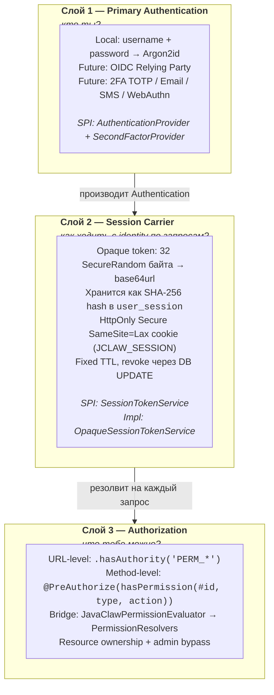

# JavaClaw — Руководство по безопасности

> **Статус:** Модуль cookie-session аутентификации, MVP v1 (2026-04-11)
> **Модуль:** `javaclaw-security`
> **Language:** [English version](./security_EN.md)

---

## Содержание

1. [Концепция](#1-концепция)
2. [Архитектура](#2-архитектура)
3. [Стек технологий](#3-стек-технологий)
4. [Поток аутентификации](#4-поток-аутентификации)
5. [Модель авторизации](#5-модель-авторизации)
6. [Схема БД](#6-схема-бд)
7. [Что реализовано](#7-что-реализовано)
8. [Что не реализовано (Roadmap)](#8-что-не-реализовано-roadmap)
9. [Справочник настроек](#9-справочник-настроек)
10. [Чек-лист выкатки в продакшен](#10-чек-лист-выкатки-в-продакшен)
11. [Модель угроз](#11-модель-угроз)
12. [Разработка и тестирование](#12-разработка-и-тестирование)

---

## 1. Концепция

JavaClaw использует схему аутентификации через **непрозрачный session cookie**
поверх STATELESS цепочки фильтров Spring Security. Архитектура намеренно
сделана слоистой: каждый компонент (primary authentication, session carrier,
authorization) можно заменить, не переписывая остальные.

**Ключевые инварианты:**

- Пароль (или любой переиспользуемый credential) **никогда** не хранится
  в браузере.
- Session cookie — `HttpOnly`, `Secure`, `SameSite=Lax`. JavaScript его не видит.
- 401 ответы от API **никогда** не содержат заголовок `WWW-Authenticate` —
  нативный браузерный Basic-auth prompt не появляется ни при каких запросах.
- Решения по авторизации централизованы в `PermissionEvaluator`-bridge,
  а не размазаны по контроллерам.
- Будущие методы аутентификации (OIDC Relying Party, TOTP, Email OTP, SMS OTP,
  WebAuthn) подключаются в готовые SPI — без ломки API-контрактов.

---

## 2. Архитектура

### 2.1 Трёхслойная модель



### 2.2 Структура пакетов (`javaclaw-security`)

```
ai.javaclaw.security
├── config/
│   ├── SecurityConfig              — SecurityFilterChain, CSRF, STATELESS
│   ├── AuthenticationConfig        — PasswordEncoder, AuthenticationManager
│   ├── MethodSecurityConfig        — @EnableMethodSecurity + PermissionEvaluator
│   ├── SchedulingConfig            — @EnableScheduling
│   ├── SecurityAutoConfiguration   — @EnableConfigurationProperties
│   ├── ApiAuthenticationEntryPoint — 401 без WWW-Authenticate
│   ├── CookieProperties            — @ConfigurationProperties
│   └── SessionProperties           — @ConfigurationProperties
├── session/
│   ├── UserSession                 — Spring Data JDBC entity
│   ├── UserSessionRepository       — CrudRepository
│   ├── SessionTokenService         — SPI
│   ├── OpaqueSessionTokenService   — дефолтная реализация
│   ├── SessionCookieAuthFilter     — OncePerRequestFilter
│   ├── SessionCookieWriter         — билдер Set-Cookie заголовка
│   ├── SessionCleanupJob           — @Scheduled чистка
│   └── ClientInfo / IssuedToken    — value-типы
├── authn/
│   ├── AuthenticationService       — фасад login()
│   ├── JdbcUserDetailsService      — загружает пользователей из БД
│   ├── AuthorityMapper             — Permission → GrantedAuthority
│   ├── LoginResult                 — sealed тип результата
│   ├── UserInfo                    — DTO
│   └── twofactor/
│       ├── SecondFactorProvider    — SPI
│       ├── NoopSecondFactorProvider — дефолт (всегда NONE)
│       ├── SecondFactorChallenge    — record
│       └── SecondFactorMethod       — enum
├── authz/
│   ├── JavaClawPermissionEvaluator        — реализация Spring PermissionEvaluator
│   ├── PermissionResolvers                — реестр resource-level проверок
│   ├── PermissionCheck                    — функциональный интерфейс
│   └── DefaultPermissionResolversRegistrar — регистрация conversation/task/skill/mcp
├── audit/
│   ├── AuthEventType               — enum
│   ├── AuthAuditService            — пишет в auth_audit_log
│   └── AuthEventListener           — Spring Security события → audit
└── web/
    ├── AuthController              — /api/auth/**
    ├── AuthExceptionHandler        — @RestControllerAdvice
    ├── LoginRequest / LoginResponse — records
    └── SessionInfoDto               — record
```

---

## 3. Стек технологий

| Компонент                    | Технология                                              |
| ---------------------------- | ------------------------------------------------------- |
| Фреймворк                    | Spring Boot 4.0.5, Spring Security 6.x / 7.x            |
| Язык / Runtime               | Java 21                                                 |
| Хэширование паролей          | Argon2id (BouncyCastle `bcprov-jdk18on:1.79`)           |
| Legacy хэширование           | bcrypt (auto-upgrade в Argon2id при следующем логине)   |
| Хранилище сессий             | PostgreSQL 16+ через Spring Data JDBC                   |
| Session token                | 256-бит `SecureRandom` → base64url → SHA-256 hash       |
| Транспорт сессии             | `HttpOnly` `Secure` `SameSite=Lax` cookie (`JCLAW_SESSION`) |
| CSRF                         | `CookieCsrfTokenRepository` + `CsrfTokenRequestAttributeHandler` (без XOR) |
| Method security              | `@PreAuthorize` + кастомный `PermissionEvaluator`       |
| Миграции                     | Flyway (V39 `user_session`, V40 audit event types, V41 FK relax) |
| Аудит                        | Таблица `auth_audit_log` (V29)                           |
| Фронтенд                     | React 18 + TanStack Router + Jotai + Vite               |
| Тесты                        | JUnit 5, Mockito, AssertJ, Testcontainers, MockMvc, Vitest, Playwright |

---

## 4. Поток аутентификации

### 4.1 Логин

```mermaid
sequenceDiagram
    autonumber
    participant B as Браузер
    participant AC as AuthController
    participant AS as AuthenticationService
    participant STS as SessionTokenService
    participant DB as PostgreSQL

    B->>AC: POST /api/auth/login<br/>{username, password}
    AC->>AS: login(username, password, clientInfo)
    AS->>AS: AuthenticationManager.authenticate()
    Note over AS: DaoAuthenticationProvider<br/>+ Argon2id PasswordEncoder
    AS->>AS: SecondFactorProvider.isRequired()
    Note over AS: NoopSecondFactorProvider<br/>возвращает false (MVP)
    AS->>STS: issue(authentication, clientInfo, ttl)
    STS->>STS: SecureRandom 32 байта → base64url
    STS->>STS: SHA-256 hash
    STS->>DB: INSERT INTO user_session
    DB-->>STS: ok
    STS-->>AS: IssuedToken(rawToken, sessionId, expiresAt)
    AS-->>AC: LoginResult.Success
    AC->>DB: auth_audit_log ← LOGIN_SUCCESS
    AC-->>B: 200 OK<br/>Set-Cookie: JCLAW_SESSION=&lt;raw&gt;; HttpOnly; Secure; SameSite=Lax<br/>Тело: { user, sessionExpiresAt }
```

### 4.2 Последующий запрос (REST или SSE)

```mermaid
sequenceDiagram
    autonumber
    participant B as Браузер
    participant F as SessionCookieAuthFilter
    participant STS as SessionTokenService
    participant PE as PermissionEvaluator
    participant C as Контроллер

    B->>F: GET /api/conversations/{id}/messages<br/>Cookie: JCLAW_SESSION=&lt;raw&gt;
    F->>STS: resolve(rawToken)
    STS->>STS: sha256(rawToken)
    STS->>STS: SELECT FROM user_session<br/>WHERE token_hash = ? AND not revoked<br/>AND expires_at > NOW()
    STS-->>F: Authentication
    F->>F: SecurityContextHolder.set(auth)
    F->>C: filterChain.doFilter()
    C->>PE: @PreAuthorize hasPermission(#id, 'conversation', 'read')
    PE->>PE: PermissionResolvers.get("conversation")
    Note over PE: CONVERSATION_ACCESS_ALL<br/>ИЛИ проверка ownership
    PE-->>C: true
    C-->>B: 200 OK + JSON
```

SSE endpoints работают абсолютно так же — браузер автоматически прикрепляет
cookie к любому same-origin `EventSource`-запросу, включая
`/api/chat/notifications/{id}`. Никакого `?auth=` query-параметра или
кастомного транспорта не требуется.

### 4.3 Logout

- `POST /api/auth/logout` — revoke текущей сессии (`revoked_at = NOW()`),
  очистка cookie (`Max-Age=0`), запись `LOGOUT` в аудит.
- `POST /api/auth/logout-all` — revoke **всех** активных сессий текущего
  пользователя (полезно после смены пароля или потери устройства).

---

## 5. Модель авторизации

Авторизация имеет два уровня:

### 5.1 URL-level (грубо-гранулярная)

Декларируется в `SecurityConfig`, проверяется до входа в метод контроллера:

```java
.requestMatchers("/api/skills/**").hasAuthority("PERM_SKILL_LIST")
.requestMatchers("/api/mcp-servers/**").hasAuthority("PERM_MCP_LIST")
.requestMatchers("/api/users/**").hasAuthority("PERM_USER_LIST")
.requestMatchers("/api/audit/**").hasAuthority("PERM_AUDIT_READ")
.requestMatchers("/api/**").authenticated()
```

Authorities берутся из таблицы `role_permissions` через `PermissionService`
и преобразуются в `PERM_*` / `ROLE_*` через `AuthorityMapper`.

### 5.2 Method-level (тонко-гранулярная, с учётом ресурса)

Декларируется аннотацией `@PreAuthorize` на методах контроллера:

```java
@PreAuthorize("hasPermission(#id, 'conversation', 'read')")
@GetMapping("/{id}/messages")
public PageResponse<MessageDto> messages(@PathVariable String id, ...) { ... }
```

Expression вызывает `JavaClawPermissionEvaluator.hasPermission(auth, id,
"conversation", "read")`, который ищет `"conversation"` resolver в
`PermissionResolvers`. Дефолтный conversation resolver реализует **admin-bypass**:

```java
resolvers.register("conversation", (username, targetId, action) -> {
    if (hasPermission(username, Permission.CONVERSATION_ACCESS_ALL)) return true;
    return conversationSharingService.hasAccess(targetId, userId, username);
});
```

Зарегистрированные resolver'ы (`DefaultPermissionResolversRegistrar`):

| Тип ресурса    | Логика                                                         |
| -------------- | -------------------------------------------------------------- |
| `conversation` | `CONVERSATION_ACCESS_ALL` ИЛИ проверка ownership/sharing       |
| `task`         | Проверка permission `TASK_LIST`                                |
| `skill`        | `SKILL_<ACTION>` permission (fallback на `SKILL_LIST`)         |
| `mcp`          | `MCP_<ACTION>` permission (fallback на `MCP_LIST`)             |

Добавление нового типа ресурса — один вызов `resolvers.register(...)` в
новом `InitializingBean`.

---

## 6. Схема БД

### 6.1 `user_session` (Flyway V39)

```sql
CREATE TABLE user_session (
    id                VARCHAR(36)  NOT NULL,
    token_hash        VARCHAR(64)  NOT NULL,
    user_id           VARCHAR(36)  NOT NULL,
    created_at        TIMESTAMPTZ  NOT NULL DEFAULT NOW(),
    expires_at        TIMESTAMPTZ  NOT NULL,
    last_used_at      TIMESTAMPTZ  NOT NULL DEFAULT NOW(),
    remote_addr       VARCHAR(64),
    user_agent        VARCHAR(512),
    revoked_at        TIMESTAMPTZ,
    revocation_reason VARCHAR(64),
    CONSTRAINT pk_user_session PRIMARY KEY (id),
    CONSTRAINT uq_user_session_token_hash UNIQUE (token_hash)
);

CREATE INDEX idx_user_session_user_id    ON user_session (user_id);
CREATE INDEX idx_user_session_expires_at ON user_session (expires_at);
```

- `token_hash` — SHA-256 hex от raw токена. Сам raw токен никогда не хранится.
- `last_used_at` — обновляется не чаще одного раза в 60 секунд на сессию
  (throttle в памяти), чтобы не создавать write amplification на hot GET'ах.

### 6.2 `auth_audit_log` (Flyway V29, расширена V40)

Хранит каждое auth-событие: `login_success`, `login_failure`, `logout`,
`logout_all`, `session_created`, `session_revoked`, `second_factor_challenge`,
`second_factor_success`, `second_factor_failure`, `access_denied`.

Записи выполняются асинхронно (`@Async`) по best-effort — сбои логируются на
уровне `WARN` и проглатываются, чтобы не ухудшать доступность логина при
проблемах с БД.

---

## 7. Что реализовано

- **Аутентификация по паролю** — Argon2id с legacy fallback на bcrypt; пароли
  автоматически перехешируются в Argon2id при следующем успешном логине через
  hook `DaoAuthenticationProvider.upgradeEncoding()`.
- **Cookie-session flow** — `POST /api/auth/login` выдаёт opaque session cookie;
  все последующие API-вызовы аутентифицируются через этот cookie.
- **Управление сессиями** — `GET /api/auth/sessions` возвращает список активных
  сессий текущего пользователя; `DELETE /api/auth/sessions/{id}` revoke'ает
  конкретную; `POST /api/auth/logout-all` revoke'ает все сессии пользователя.
- **CSRF защита** — `CookieCsrfTokenRepository.withHttpOnlyFalse()` пишет cookie
  `XSRF-TOKEN`; SPA читает его и отправляет в заголовке `X-XSRF-TOKEN` на всех
  mutating методах (POST / PUT / PATCH / DELETE). Используется
  `CsrfTokenRequestAttributeHandler` (не дефолтный `XorCsrfTokenRequestAttributeHandler`),
  чтобы токен не XOR-маскировался — это требование для простого паттерна
  read-cookie-echo-header.
- **Нет Basic-auth prompt** — `ApiAuthenticationEntryPoint` возвращает `401` с
  JSON-телом и **без** заголовка `WWW-Authenticate`, независимо от запроса.
- **Method-level авторизация** — `@PreAuthorize(hasPermission(...))` через
  кастомный `PermissionEvaluator` + реестр resolver'ов, с admin-bypass через
  `CONVERSATION_ACCESS_ALL`.
- **Audit log** — каждый login, failure, logout, session revoke пишется
  асинхронно в `auth_audit_log`.
- **Чистка сессий** — `@Scheduled` job раз в час удаляет expired сессии и
  revoked сессии старше 7 дней.
- **SSE поверх cookie** — браузерный `EventSource` автоматически прикрепляет
  cookie; никакого query-параметра `?auth=`.
- **2FA SPI (заглушка)** — `SecondFactorProvider` SPI с `NoopSecondFactorProvider`
  по умолчанию. `AuthenticationService.login()` уже обрабатывает ветку
  `LoginResult.SecondFactorRequired`, поэтому добавление TOTP/OTP — plug-in
  изменение, а не переписывание контракта.
- **Фронтенд-интеграция** — `src/api/auth.ts`, `src/lib/csrf.ts`,
  `src/store/auth.ts` (без localStorage credentials), `src/api/http.ts` с
  `credentials: "include"` + CSRF header, `src/hooks/use-auth.ts` cookie flow,
  `__root.tsx` async `getMe()` route guard.
- **Покрытие тестами** — 90 unit-тестов в `javaclaw-security`, 9-тестовая
  интеграционная сьют (`AuthIntegrationTest`), 5 новых Playwright E2E тестов,
  полный `mvn verify` зелёный на 17 модулях.

---

## 8. Что не реализовано (Roadmap)

Для каждого пункта существует roadmap-документ в
`javaclaw-security/docs/`. Все пункты можно добавить без ломки существующих
контрактов.

### 8.1 OIDC Relying Party

См. `javaclaw-security/docs/oidc-relying-party-roadmap.md`.

- Интеграция с внешним IdP (Keycloak / Yandex ID / Auth0) как RP.
- Authorization Code + PKCE flow через Spring Security `oauth2Login()`.
- `OAuth2LoginSuccessHandler` вызывает тот же `SessionTokenService.issue()`,
  что и локальный логин — слой cookie не меняется.
- Flyway V43 добавляет `external_provider` + `external_subject` в `users`.
- Связывание аккаунтов по email, кнопки "Sign in with X" на UI.

### 8.2 Двухфакторная аутентификация

См. `javaclaw-security/docs/two-factor-roadmap.md`.

- **TOTP (RFC 6238)** — Phase 1, высший приоритет. Требует V41
  `user_totp_secret` таблицу, dependency `googleauth`,
  `TotpSecondFactorProvider`, endpoints `/api/auth/totp/enroll|confirm|disable`
  и `/api/auth/login/second-factor`, recovery codes (V41b), lockout после N
  неудачных попыток.
- **Email OTP** — Phase 2. V42 `otp_challenge` таблица, интеграция почтового
  отправителя.
- **SMS OTP** — Phase 3. `SmsGateway` SPI, provider-agnostic.
- **WebAuthn / Passkeys** — Phase 4. Интеграция `webauthn4j-spring-security`,
  registration + authentication ceremonies.

### 8.3 Админское управление сессиями

См. `javaclaw-security/docs/admin-session-management.md`.

- `GET /api/admin/users/{userId}/sessions` — список сессий любого пользователя
  (требует `PERM_SESSION_ADMIN`).
- `DELETE /api/admin/users/{userId}/sessions` — revoke всех сессий пользователя.
- `GET /api/admin/sessions/stats` — счётчик одновременных сессий, гистограмма IP.
- React-маршрут `/admin/sessions`.

### 8.4 Прочие отложенные пункты

- **Rate limiting на login** — Bucket4j или аналог, N попыток на IP+user.
- **Account lockout policy** — блокировка после K неудачных логинов.
- **Password reset** — email-based flow.
- **Horizontal-scale session store** — переключить `OpaqueSessionTokenService`
  на Redis-backed реализацию (или JWT) для multi-instance развёртываний.
  Сейчас throttle `lastUsedAt` использует in-memory `ConcurrentHashMap`, который
  не шарится между JVM-инстансами.
- **Service-to-service API keys** — отдельный механизм для MCP / A2A / CLI
  клиентов (сегодня они используют тот же session cookie, что и люди).

---

## 9. Справочник настроек

### 9.1 `application.yaml`

```yaml
javaclaw:
  security:
    cookie:
      name: JCLAW_SESSION          # имя cookie
      path: /                      # путь
      domain: ""                   # оставить пустым для same-origin
      secure: true                 # обязательно true в продакшене
      same-site: Lax               # Strict / Lax / None
      max-age-seconds: 86400       # 24 часа
    session:
      ttl: PT24H                   # те же 24ч, ISO 8601 duration
      cleanup-interval: PT1H       # интервал запуска cleanup job
```

### 9.2 Dev-профиль (HTTP, локально)

Для локальной разработки без HTTPS отключаем `secure`:

```yaml
# application-dev.yaml
javaclaw:
  security:
    cookie:
      secure: false                # HTTP-only localhost
      same-site: Lax
```

> **Внимание:** `secure: false` **нельзя** ставить в продакшене или любом
> окружении, доступном из публичного интернета.

### 9.3 Кастомный TTL сессии

Короткоживущие сессии для high-security окружений:

```yaml
javaclaw:
  security:
    session:
      ttl: PT2H                    # 2 часа
      cleanup-interval: PT15M      # более частая чистка
    cookie:
      max-age-seconds: 7200
```

### 9.4 Тюнинг Argon2id

Дефолтные параметры (в `AuthenticationConfig.passwordEncoder()`):

```java
encoders.put("argon2", new Argon2PasswordEncoder(
    16,      // saltLength
    32,      // hashLength
    1,       // parallelism
    19456,   // memory в KiB (~19 MB)
    2        // iterations
));
```

Это рекомендации OWASP 2024. Для железа с большим объёмом памяти увеличьте
`memory` до `65536` (64 MB) и `iterations` до `3`.

### 9.5 Добавление нового permission resolver

Чтобы включить resource-level авторизацию на новом типе ресурса, зарегистрируйте
resolver в новом `InitializingBean` (или расширьте `DefaultPermissionResolversRegistrar`):

```java
@Component
@RequiredArgsConstructor
public class FilePermissionRegistrar implements InitializingBean {
    private final PermissionResolvers resolvers;
    private final FileOwnershipService fileOwnershipService;
    private final PermissionService permissionService;

    @Override
    public void afterPropertiesSet() {
        resolvers.register("file", (username, fileId, action) -> {
            if (permissionService.userHasPermission(username, Permission.FILE_ADMIN)) {
                return true;
            }
            return fileOwnershipService.isOwner(fileId.toString(), username);
        });
    }
}
```

Затем на контроллере:

```java
@PreAuthorize("hasPermission(#fileId, 'file', 'read')")
@GetMapping("/api/files/{fileId}")
public FileDto get(@PathVariable String fileId) { ... }
```

### 9.6 Интеграция на фронтенде

Фронтенд трактует сессию как opaque — он никогда не читает и не хранит
значение cookie:

```typescript
// src/api/auth.ts
import { apiJson } from "./http"

export async function login(username: string, password: string) {
  return apiJson<LoginResponse>("/api/auth/login", {
    method: "POST",
    body: { username, password },
  })
}

export async function getMe() {
  return apiJson<UserInfo>("/api/auth/me")
}
```

`apiJson` автоматически:

- Выставляет `credentials: "include"` на каждый fetch (чтобы cookie уехал).
- Читает cookie `XSRF-TOKEN` и echo'ит его в `X-XSRF-TOKEN` на mutating методах.
- Редиректит на `/login` при любом 401 (кроме явного `skipAuthRedirect`).

---

## 10. Чек-лист выкатки в продакшен

Перед выходом в прод проверьте **каждый** пункт:

- [ ] HTTPS терминируется перед приложением (reverse proxy / LB).
- [ ] `javaclaw.security.cookie.secure = true` (default).
- [ ] `javaclaw.security.cookie.same-site = Lax` (или `Strict`, если нет OIDC).
- [ ] Соединение с БД защищено (TLS до Postgres).
- [ ] Flyway применил миграции V39, V40, V41 на целевой БД.
- [ ] В таблице `users` есть хотя бы один admin с ненулевым `password_hash`
      (для новых установок — префикс `argon2`).
- [ ] Дефолтные пароли из `V10__seed_default_users.sql` заменены.
- [ ] Session cleanup job работает (проверить логи на `SessionCleanupJob`).
- [ ] Reverse proxy пробрасывает `Cookie`, `X-XSRF-TOKEN`, `X-Forwarded-For`.
- [ ] Reverse proxy **не** вырезает `Set-Cookie` заголовки.
- [ ] Определена retention policy на `auth_audit_log` (внешний cron / cleanup).
- [ ] Мониторинг: алерты на всплеск `login_failure`.
- [ ] Бэкапы включают таблицу `user_session` (чтобы сессии пережили restore —
      либо явная политика revoke всех сессий при restore).

---

## 11. Модель угроз

| Угроза                                | Митигация                                                                 |
| ------------------------------------- | ------------------------------------------------------------------------- |
| **XSS → кража токена**                | Cookie `HttpOnly`, недоступен из JS                                       |
| **CSRF**                              | Заголовок `X-XSRF-TOKEN` обязателен на mutating запросах; `SameSite=Lax`  |
| **Утечка БД с паролями**              | Argon2id с высокими cost параметрами                                      |
| **Session fixation**                  | На каждый логин — свежий случайный токен, старые не переиспользуются      |
| **Replay украденного cookie**         | Сессии revoke'аются; `/logout-all` + audit trail; ограниченный TTL        |
| **Brute force**                       | (пока не реализовано — rate limiting в roadmap)                           |
| **Браузерный Basic-auth prompt**      | Кастомный `AuthenticationEntryPoint` не шлёт `WWW-Authenticate`           |
| **Утечка токена в URL (SSE)**         | SSE через cookie, никакого `?auth=` query-параметра                       |
| **Horizontal privilege escalation**   | `@PreAuthorize(hasPermission(...))` на всех resource endpoints            |
| **Подмена audit log**                 | `auth_audit_log` append-only; обязательна retention policy                |
| **Dictionary attack по user table**   | Argon2id + одинаковые 401 для неизвестного и неверного пользователя       |

---

## 12. Разработка и тестирование

### 12.1 Запуск тестов

```bash
# Все unit-тесты security модуля
mvn -pl javaclaw-security test

# Integration тесты (Testcontainers PostgreSQL)
mvn -pl javaclaw-app test -Dtest="AuthIntegrationTest"

# Полная сборка (все модули)
mvn -T 1C clean verify

# Playwright E2E (требует запущенного приложения)
mvn -pl javaclaw-e2e verify -Pe2e
```

### 12.2 Ручной smoke-тест

```bash
# 1. Старт приложения
java -jar javaclaw-app/target/javaclaw-app-exec.jar

# 2. Bootstrap CSRF cookie (сервер пишет XSRF-TOKEN)
curl -i -c cookies.txt http://localhost:8080/api/auth/csrf

# 3. Логин — ловим JCLAW_SESSION в cookies.txt
CSRF=$(grep XSRF-TOKEN cookies.txt | awk '{print $NF}')
curl -i -b cookies.txt -c cookies.txt \
  -H "Content-Type: application/json" \
  -H "X-XSRF-TOKEN: $CSRF" \
  -d '{"username":"admin","password":"admin"}' \
  http://localhost:8080/api/auth/login

# 4. Аутентифицированный вызов
curl -i -b cookies.txt http://localhost:8080/api/auth/me

# 5. Список активных сессий
curl -i -b cookies.txt http://localhost:8080/api/auth/sessions

# 6. Logout
curl -i -b cookies.txt \
  -H "X-XSRF-TOKEN: $CSRF" \
  -X POST http://localhost:8080/api/auth/logout
```

### 12.3 Паттерн интеграционного теста

Используйте `IntegrationTestAuthHelper` в MockMvc integration тестах:

```java
@SpringBootTest
@AutoConfigureMockMvc
@ActiveProfiles("contracttest")
class MyFeatureIntegrationTest {

    @Autowired MockMvc mockMvc;
    @Autowired ObjectMapper objectMapper;

    Cookie adminCookie;

    @BeforeEach
    void login() throws Exception {
        adminCookie = IntegrationTestAuthHelper.loginAndGetSessionCookie(
            mockMvc, objectMapper, "admin", "admin");
    }

    @Test
    void authenticatedRequest() throws Exception {
        mockMvc.perform(get("/api/conversations")
                        .cookie(adminCookie)
                        .accept(APPLICATION_JSON))
               .andExpect(status().isOk());
    }
}
```

### 12.4 Паттерн Playwright E2E

Используйте `PlaywrightE2ETestBase.loginViaApi()` — базовый класс также
ставит `registerNoDialogGuard()`, который фейлит тест при любом нативном
браузерном диалоге (regression safety против #41):

```java
class MyFeatureE2ETest extends PlaywrightE2ETestBase {

    @Test
    void featureFlow() {
        loginViaApi("admin", "admin");
        page.navigate(baseUrl + "/chat");
        // ... assertions ...
    }
}
```

### 12.5 Отладка auth-сбоев

1. Смотрим логи сервера на `a.j.s.authn.AuthenticationService` — там
   success/failure с причиной.
2. Смотрим `a.j.s.session.OpaqueSessionTokenService` — issue / resolve / revoke.
3. Запрос `auth_audit_log`:

   ```sql
   SELECT event_type, username, remote_addr, request_uri, detail, created_at
   FROM auth_audit_log
   WHERE username = 'suspicious_user'
   ORDER BY created_at DESC LIMIT 20;
   ```
4. Активные сессии пользователя:

   ```sql
   SELECT id, created_at, last_used_at, expires_at, remote_addr, user_agent
   FROM user_session
   WHERE user_id = 'alice' AND revoked_at IS NULL AND expires_at > NOW();
   ```

### 12.6 Обход auth в тестах (НЕ для продакшена)

Для `@SpringBootTest` integration-тестов, которым не важна реальная auth,
`TestSecurityConfig` (в `javaclaw-app/src/test`) ставит default MockMvc
post-processor, выставляющий `user("admin")` на каждый запрос. Расширяйте
`IntegrationTestBase`, чтобы унаследовать это поведение. Для тестов, где
нужна смена пользователя (например, isolation-тесты), **не** расширяйте
`IntegrationTestBase` — используйте `IntegrationTestAuthHelper` напрямую
с реальными cookie.

---

## Ссылки

- [Spring Security — CSRF protection](https://docs.spring.io/spring-security/reference/servlet/exploits/csrf.html)
- [Spring Security — Session management](https://docs.spring.io/spring-security/reference/servlet/authentication/session-management.html)
- [OWASP — Session Management Cheat Sheet](https://cheatsheetseries.owasp.org/cheatsheets/Session_Management_Cheat_Sheet.html)
- [OWASP — Password Storage Cheat Sheet](https://cheatsheetseries.owasp.org/cheatsheets/Password_Storage_Cheat_Sheet.html)
- [RFC 6238 — TOTP](https://datatracker.ietf.org/doc/html/rfc6238)
- [RFC 6749 — OAuth 2.0](https://datatracker.ietf.org/doc/html/rfc6749)
- План реализации: [`specs/auth-module-cookie-session-architecture.md`](../../specs/auth-module-cookie-session-architecture.md)
- OIDC roadmap: [`javaclaw-security/docs/oidc-relying-party-roadmap.md`](../../javaclaw-security/docs/oidc-relying-party-roadmap.md)
- 2FA roadmap: [`javaclaw-security/docs/two-factor-roadmap.md`](../../javaclaw-security/docs/two-factor-roadmap.md)
- Admin sessions roadmap: [`javaclaw-security/docs/admin-session-management.md`](../../javaclaw-security/docs/admin-session-management.md)
