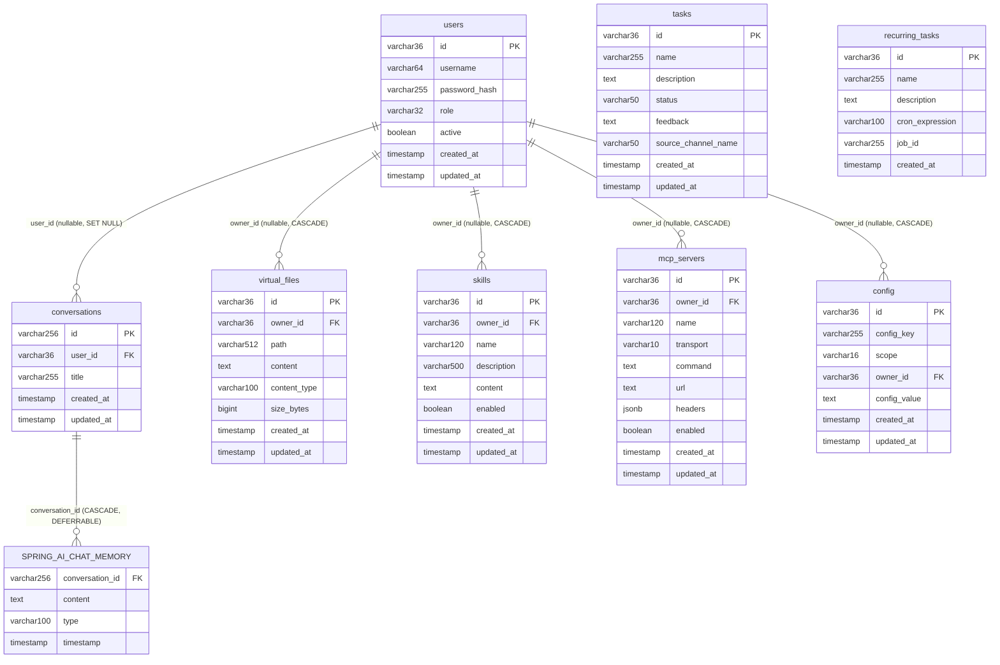

# DB Schema v1 Specification

**Status**: Draft — implementation contract for Flyway migrations V4-V10 (Roadmap task 0.1)
**Author**: builder-db-architect
**Date**: 2026-04-05
**Target release**: Phase 1.1 (DB Schema + Flyway migrations)

---

## Overview

This document defines the complete database schema v1 for JavaClaw. It serves as the authoritative
implementation contract for:

- Flyway migrations V4–V10 (atomic piece 1.1)
- Spring Data JDBC entity records (pieces 1.2, 1.4, 1.5)
- Basic Auth user model (Phase 4.1)
- Per-user resource isolation (Phases 4.2, 4.3)

**Scope**: 7 new tables (`users`, `conversations`, `virtual_files`, `skills`, `mcp_servers`, `config`)
plus ALTER on the existing `SPRING_AI_CHAT_MEMORY` table to add a FK to `conversations`.
Reference only (no changes): `tasks` (V1), `recurring_tasks` (V1), `SPRING_AI_CHAT_MEMORY` (V2/V3).

**Stack**: PostgreSQL 17, Spring Data JDBC (no JPA), Flyway incremental migrations.

**Invariant**: Migrations V1–V3 must remain untouched. V4–V10 only add new objects.

---

## Conventions

All DDL in this spec follows the conventions established in `V1__init_tasks.sql`. Deviations are
explicitly noted with rationale.

### Primary Keys

```
id VARCHAR(36) PRIMARY KEY DEFAULT gen_random_uuid()::varchar
```

- Type `VARCHAR(36)` (not native `UUID`) for consistent Spring Data JDBC mapping without custom converters.
- `gen_random_uuid()` built-in since PostgreSQL 13; no extension required.
- Cast `::varchar` to align with the `VARCHAR(36)` column type.
- Exception: `conversations.id` is `VARCHAR(256)` (no default) because it must match the
  `SPRING_AI_CHAT_MEMORY.conversation_id VARCHAR(256)` column generated by Spring AI.

### Timestamps

```
created_at TIMESTAMP NOT NULL DEFAULT now()
updated_at TIMESTAMP NOT NULL DEFAULT now()
```

- `TIMESTAMP` without time zone — follows V1 convention; avoids timezone complexity in a single-region deployment.
- `DEFAULT now()` — set by the database at insert time.
- `updated_at` is updated by application logic on every write (no database trigger, to keep DDL simple).

### Naming

- All identifiers: `snake_case` lowercase.
- Exception: `SPRING_AI_CHAT_MEMORY` retains its framework-defined uppercase name.
- Index names: `idx_<table>_<column>` for single-column indexes; `idx_<table>_<col1>_<col2>` for composites.
- Unique index names: `uq_<table>_<description>`.
- FK constraint names: `fk_<child_table>_<parent_table>` or `fk_<child>_<column>`.

### Ownership Model

Resource tables (`virtual_files`, `skills`, `mcp_servers`, `config`) use a nullable `owner_id` column:

| `owner_id` value |                    Meaning                    |
|------------------|-----------------------------------------------|
| `NULL`           | Global resource — visible to all users (read) |
| `<users.id>`     | Personal resource — visible only to that user |

This allows a single table to store both global (system-provided) and per-user resources.

### Partial Unique Indexes for Nullable Owner

Standard `UNIQUE` constraints treat `NULL != NULL`, which would allow unlimited duplicate global records.
To enforce uniqueness for both personal and global resources, **partial unique indexes** are used instead
of regular `UNIQUE` constraints:

```sql
-- Personal resources: unique name per user
CREATE UNIQUE INDEX uq_skills_user_name ON skills(owner_id, name) WHERE owner_id IS NOT NULL;

-- Global resources: unique name among globals
CREATE UNIQUE INDEX uq_skills_global_name ON skills(name) WHERE owner_id IS NULL;
```

This pattern is applied to `virtual_files`, `skills`, `mcp_servers`, and `config`.

### FK ON DELETE Rules

|                        Relationship                        |         Rule         |                                 Rationale                                  |
|------------------------------------------------------------|----------------------|----------------------------------------------------------------------------|
| `conversations.user_id → users.id`                         | `ON DELETE SET NULL` | Conversation history is retained when user is deleted (guest-mode support) |
| `virtual_files.owner_id → users.id`                        | `ON DELETE CASCADE`  | Files are personal data — delete with user                                 |
| `skills.owner_id → users.id`                               | `ON DELETE CASCADE`  | Personal skills deleted with user                                          |
| `mcp_servers.owner_id → users.id`                          | `ON DELETE CASCADE`  | Personal MCP configs deleted with user                                     |
| `config.owner_id → users.id`                               | `ON DELETE CASCADE`  | Personal config deleted with user                                          |
| `SPRING_AI_CHAT_MEMORY.conversation_id → conversations.id` | `ON DELETE CASCADE`  | Messages belong to conversation lifecycle                                  |

---

## ER Diagram



---

## Tables

### Table: users

**Purpose**: User accounts for Phase 4.1 Basic Auth. Central ownership anchor for all personal resources.

#### DDL

```sql
CREATE TABLE users (
    id            VARCHAR(36)  PRIMARY KEY DEFAULT gen_random_uuid()::varchar,
    username      VARCHAR(64)  NOT NULL,
    password_hash VARCHAR(255),
    role          VARCHAR(32)  NOT NULL DEFAULT 'USER'
                      CHECK (role IN ('ADMIN', 'USER')),
    active        BOOLEAN      NOT NULL DEFAULT true,
    created_at    TIMESTAMP    NOT NULL DEFAULT now(),
    updated_at    TIMESTAMP    NOT NULL DEFAULT now()
);

CREATE UNIQUE INDEX uq_users_username ON users(username);
CREATE INDEX idx_users_role       ON users(role);
CREATE INDEX idx_users_active     ON users(active);
```

#### Column Rationale

|     Column      |     Type     | Nullable |                                                     Rationale                                                     |
|-----------------|--------------|----------|-------------------------------------------------------------------------------------------------------------------|
| `id`            | VARCHAR(36)  | NOT NULL | Standard UUID PK; FK target for all resource tables                                                               |
| `username`      | VARCHAR(64)  | NOT NULL | Login name; 64 chars sufficient for usernames; unique via index                                                   |
| `password_hash` | VARCHAR(255) | NULL     | BCrypt hash (60 chars); NULL = account not yet configured; **AuthenticationProvider MUST reject login when NULL** |
| `role`          | VARCHAR(32)  | NOT NULL | Single role per user; CHECK constraint enforces enum; expandable to roles table in Phase 7                        |
| `active`        | BOOLEAN      | NOT NULL | Soft-disable users without deleting; Phase 4.1 must check `active = true` at login                                |
| `created_at`    | TIMESTAMP    | NOT NULL | Audit trail                                                                                                       |
| `updated_at`    | TIMESTAMP    | NOT NULL | Updated by application on every write                                                                             |

#### Index Rationale

- `uq_users_username`: login lookup is by username; uniqueness enforced at DB level.
- `idx_users_role`: admin listings filtered by role.
- `idx_users_active`: most queries filter out inactive users.

#### FK Rules

No FK outbound from `users`. It is the root ownership anchor.

#### Security Note

`password_hash IS NULL` semantics: V10 seeds `admin` and `user` rows with `password_hash = NULL`.
Phase 4.1 `AuthenticationProvider` MUST explicitly reject authentication when `password_hash IS NULL`.
Never interpret a NULL hash as "no password required".

#### Sample INSERT

```sql
-- Used in DbSchemaV1SpecTest
INSERT INTO users (id, username, password_hash, role, active)
VALUES
    ('00000000-0000-0000-0000-000000000001', 'testadmin',
     '$2a$12$placeholder_hash_admin', 'ADMIN', true),
    ('00000000-0000-0000-0000-000000000002', 'testuser',
     '$2a$12$placeholder_hash_user', 'USER', true);
```

---

### Table: conversations

**Purpose**: Metadata layer for Spring AI chat sessions. Links `SPRING_AI_CHAT_MEMORY` messages to
users and provides a human-readable title. `id` is intentionally `VARCHAR(256)` to match
`SPRING_AI_CHAT_MEMORY.conversation_id` exactly.

#### DDL

```sql
CREATE TABLE conversations (
    id         VARCHAR(256) PRIMARY KEY,
    user_id    VARCHAR(36)  REFERENCES users(id) ON DELETE SET NULL,
    title      VARCHAR(255),
    created_at TIMESTAMP    NOT NULL DEFAULT now(),
    updated_at TIMESTAMP    NOT NULL DEFAULT now()
);

CREATE INDEX idx_conversations_user_id    ON conversations(user_id);
CREATE INDEX idx_conversations_created_at ON conversations(created_at);
```

#### ALTER SPRING_AI_CHAT_MEMORY (in V5)

```sql
ALTER TABLE "SPRING_AI_CHAT_MEMORY"
    ADD CONSTRAINT fk_chat_memory_conversation_id
    FOREIGN KEY (conversation_id)
    REFERENCES conversations(id)
    ON DELETE CASCADE
    DEFERRABLE INITIALLY DEFERRED;
```

**Why DEFERRABLE**: Spring AI creates chat memory entries eagerly. The application may create
`SPRING_AI_CHAT_MEMORY` rows before the corresponding `conversations` row is committed in the same
transaction. `DEFERRABLE INITIALLY DEFERRED` allows the FK check to be postponed to commit time,
preventing constraint violations during lazy conversation initialization.

#### Column Rationale

|    Column    |     Type     |  Nullable   |                                            Rationale                                             |
|--------------|--------------|-------------|--------------------------------------------------------------------------------------------------|
| `id`         | VARCHAR(256) | NOT NULL PK | Must match `SPRING_AI_CHAT_MEMORY.conversation_id`; no `DEFAULT` — value comes from Spring AI    |
| `user_id`    | VARCHAR(36)  | NULL        | Nullable: supports guest (unauthenticated) sessions; `SET NULL` on user delete preserves history |
| `title`      | VARCHAR(255) | NULL        | Optional human-readable name; set by UI or auto-generated                                        |
| `created_at` | TIMESTAMP    | NOT NULL    | Conversation start time                                                                          |
| `updated_at` | TIMESTAMP    | NOT NULL    | Last message time (updated by application)                                                       |

#### Index Rationale

- `idx_conversations_user_id`: list conversations by user is the primary query.
- `idx_conversations_created_at`: ordering/pagination by recency.

#### Sample INSERT

```sql
INSERT INTO conversations (id, user_id, title)
VALUES
    ('conv-test-001', '00000000-0000-0000-0000-000000000001', 'Test conversation'),
    ('conv-guest-001', NULL, 'Guest session');
```

---

### Table: virtual_files

**Purpose**: Replaces filesystem-based `./workspace/` storage (see `WorkspaceFileService`). Stores
file content in the database for per-user isolation and consistent backup/restore.

#### DDL

```sql
CREATE TABLE virtual_files (
    id           VARCHAR(36)  PRIMARY KEY DEFAULT gen_random_uuid()::varchar,
    owner_id     VARCHAR(36)  REFERENCES users(id) ON DELETE CASCADE,
    path         VARCHAR(512) NOT NULL,
    content      TEXT,
    content_type VARCHAR(100) NOT NULL DEFAULT 'text/plain',
    size_bytes   BIGINT       NOT NULL DEFAULT 0,
    created_at   TIMESTAMP    NOT NULL DEFAULT now(),
    updated_at   TIMESTAMP    NOT NULL DEFAULT now()
);

CREATE INDEX idx_virtual_files_owner_id ON virtual_files(owner_id);
CREATE INDEX idx_virtual_files_path     ON virtual_files(path);

-- Partial unique indexes (owner_id IS NULL = global; must also be unique among globals)
CREATE UNIQUE INDEX uq_virtual_files_user_path
    ON virtual_files(owner_id, path) WHERE owner_id IS NOT NULL;

CREATE UNIQUE INDEX uq_virtual_files_global_path
    ON virtual_files(path) WHERE owner_id IS NULL;
```

#### Column Rationale

|     Column     |     Type     | Nullable |                                    Rationale                                    |
|----------------|--------------|----------|---------------------------------------------------------------------------------|
| `id`           | VARCHAR(36)  | NOT NULL | Standard UUID PK                                                                |
| `owner_id`     | VARCHAR(36)  | NULL     | NULL = global template file; non-null = personal file                           |
| `path`         | VARCHAR(512) | NOT NULL | Virtual path e.g. `/AGENT.md`, `/workspace/output.txt`; 512 allows nested paths |
| `content`      | TEXT         | NULL     | File body; NULL allowed for empty/binary placeholder files                      |
| `content_type` | VARCHAR(100) | NOT NULL | MIME type; default `text/plain`; used by API responses                          |
| `size_bytes`   | BIGINT       | NOT NULL | Derived from `content` length; updated by application; used for quota checks    |
| `created_at`   | TIMESTAMP    | NOT NULL | Audit                                                                           |
| `updated_at`   | TIMESTAMP    | NOT NULL | Last write time                                                                 |

#### Partial Unique Index Rationale

Standard `UNIQUE(owner_id, path)` would allow multiple `(NULL, '/AGENT.md')` rows because
`NULL != NULL` in SQL. Two partial indexes enforce the correct invariant:
- One user cannot have two files at the same path.
- The global namespace also has exactly one file per path.

#### FK Rules

`ON DELETE CASCADE`: personal files are user data and have no value without the owner.

#### Sample INSERT

```sql
INSERT INTO virtual_files (owner_id, path, content, content_type, size_bytes)
VALUES
    (NULL, '/AGENT.md', '# Global agent instructions', 'text/markdown', 28),
    ('00000000-0000-0000-0000-000000000001', '/AGENT.md',
     '# Personal overrides', 'text/markdown', 20);
```

---

### Table: skills

**Purpose**: Persistent storage for agent skills, replacing the in-memory `ConcurrentHashMap` in
`SkillStore`. Skills survive application restarts and can be isolated per user.

#### DDL

```sql
CREATE TABLE skills (
    id          VARCHAR(36)  PRIMARY KEY DEFAULT gen_random_uuid()::varchar,
    owner_id    VARCHAR(36)  REFERENCES users(id) ON DELETE CASCADE,
    name        VARCHAR(120) NOT NULL,
    description VARCHAR(500),
    content     TEXT,
    enabled     BOOLEAN      NOT NULL DEFAULT false,
    created_at  TIMESTAMP    NOT NULL DEFAULT now(),
    updated_at  TIMESTAMP    NOT NULL DEFAULT now()
);

CREATE INDEX idx_skills_owner_id ON skills(owner_id);
CREATE INDEX idx_skills_enabled  ON skills(enabled);

CREATE UNIQUE INDEX uq_skills_user_name
    ON skills(owner_id, name) WHERE owner_id IS NOT NULL;

CREATE UNIQUE INDEX uq_skills_global_name
    ON skills(name) WHERE owner_id IS NULL;
```

#### Column Rationale

|    Column     |     Type     | Nullable |                          Rationale                           |
|---------------|--------------|----------|--------------------------------------------------------------|
| `id`          | VARCHAR(36)  | NOT NULL | Standard UUID PK                                             |
| `owner_id`    | VARCHAR(36)  | NULL     | NULL = global/system skill; non-null = personal skill        |
| `name`        | VARCHAR(120) | NOT NULL | Display name and lookup key; 120 chars sufficient            |
| `description` | VARCHAR(500) | NULL     | Short explanation shown in UI                                |
| `content`     | TEXT         | NULL     | Skill instructions/prompt body; large text allowed           |
| `enabled`     | BOOLEAN      | NOT NULL | Default `false` — skills disabled until explicitly activated |
| `created_at`  | TIMESTAMP    | NOT NULL | Audit                                                        |
| `updated_at`  | TIMESTAMP    | NOT NULL | Last modification                                            |

#### Index Rationale

- `idx_skills_owner_id`: list skills by user is the primary query.
- `idx_skills_enabled`: filter active skills for agent context loading.

#### FK Rules

`ON DELETE CASCADE`: personal skills are user data.

#### Sample INSERT

```sql
INSERT INTO skills (owner_id, name, description, content, enabled)
VALUES
    (NULL, 'code-reviewer',
     'Reviews code for quality and correctness',
     'You are an expert code reviewer...', true),
    ('00000000-0000-0000-0000-000000000001', 'personal-summarizer',
     'Summarizes documents', 'Summarize the following...', false);
```

---

### Table: mcp_servers

**Purpose**: Persistent storage for MCP server configurations, replacing the in-memory `ConcurrentHashMap`
in `McpServerStore`. Supports both `stdio` (local process) and `http` (remote Streamable MCP) transports.

#### DDL

```sql
CREATE TABLE mcp_servers (
    id         VARCHAR(36)  PRIMARY KEY DEFAULT gen_random_uuid()::varchar,
    owner_id   VARCHAR(36)  REFERENCES users(id) ON DELETE CASCADE,
    name       VARCHAR(120) NOT NULL,
    transport  VARCHAR(10)  NOT NULL
                   CHECK (transport IN ('stdio', 'http')),
    command    TEXT,
    url        TEXT,
    headers    JSONB,
    enabled    BOOLEAN      NOT NULL DEFAULT false,
    created_at TIMESTAMP    NOT NULL DEFAULT now(),
    updated_at TIMESTAMP    NOT NULL DEFAULT now()
);

CREATE INDEX idx_mcp_servers_owner_id ON mcp_servers(owner_id);
CREATE INDEX idx_mcp_servers_enabled  ON mcp_servers(enabled);

CREATE UNIQUE INDEX uq_mcp_servers_user_name
    ON mcp_servers(owner_id, name) WHERE owner_id IS NOT NULL;

CREATE UNIQUE INDEX uq_mcp_servers_global_name
    ON mcp_servers(name) WHERE owner_id IS NULL;
```

#### Column Rationale

|    Column    |     Type     | Nullable |                                             Rationale                                              |
|--------------|--------------|----------|----------------------------------------------------------------------------------------------------|
| `id`         | VARCHAR(36)  | NOT NULL | Standard UUID PK                                                                                   |
| `owner_id`   | VARCHAR(36)  | NULL     | NULL = global MCP server available to all                                                          |
| `name`       | VARCHAR(120) | NOT NULL | Logical name; used as key in Spring AI MCP client config                                           |
| `transport`  | VARCHAR(10)  | NOT NULL | `stdio` or `http`; CHECK constraint as DB-level enum                                               |
| `command`    | TEXT         | NULL     | Full shell command for `stdio` transport (e.g. `npx @modelcontextprotocol/server-filesystem /tmp`) |
| `url`        | TEXT         | NULL     | HTTP endpoint for `http` transport (Streamable MCP)                                                |
| `headers`    | JSONB        | NULL     | HTTP headers for `http` transport (e.g. Authorization); JSONB for efficient querying               |
| `enabled`    | BOOLEAN      | NOT NULL | Default `false`; must be explicitly activated                                                      |
| `created_at` | TIMESTAMP    | NOT NULL | Audit                                                                                              |
| `updated_at` | TIMESTAMP    | NOT NULL | Last configuration change                                                                          |

#### JSONB headers Rationale

`headers` is JSONB (not TEXT) to allow future queries like
`SELECT * FROM mcp_servers WHERE headers ? 'Authorization'` and to validate JSON structure at insert time.
Spring Data JDBC requires a custom converter pair for `Map<String, String>` ↔ JSONB — see Java Mapping section.

#### CHECK Constraint Rationale

`transport IN ('stdio', 'http')` prevents invalid transport values at the DB level, independent of
application validation. Extending to `sse` in the future requires only `ALTER TABLE ... DROP CONSTRAINT ...`
followed by a new CHECK.

#### FK Rules

`ON DELETE CASCADE`: personal MCP configs are user data.

#### Sample INSERT

```sql
INSERT INTO mcp_servers (owner_id, name, transport, command, enabled)
VALUES
    (NULL, 'filesystem',
     'stdio', 'npx @modelcontextprotocol/server-filesystem /workspace', true);

INSERT INTO mcp_servers (owner_id, name, transport, url, headers, enabled)
VALUES
    ('00000000-0000-0000-0000-000000000001', 'remote-search',
     'http', 'https://mcp.example.com/search',
     '{"Authorization": "Bearer test-token"}', false);
```

---

### Table: config

**Purpose**: Database-backed key-value configuration store. Replaces `application.private.yaml` for
runtime-configurable settings. Supports both global configuration (shared) and per-user overrides.

#### DDL

```sql
CREATE TABLE config (
    id           VARCHAR(36)  PRIMARY KEY DEFAULT gen_random_uuid()::varchar,
    config_key   VARCHAR(255) NOT NULL,
    scope        VARCHAR(16)  NOT NULL
                     CHECK (scope IN ('global', 'user')),
    owner_id     VARCHAR(36)  REFERENCES users(id) ON DELETE CASCADE,
    config_value TEXT,
    created_at   TIMESTAMP    NOT NULL DEFAULT now(),
    updated_at   TIMESTAMP    NOT NULL DEFAULT now()
);

CREATE INDEX idx_config_config_key ON config(config_key);
CREATE INDEX idx_config_owner_id   ON config(owner_id);

-- Same key can exist once as global and once per user (user overrides global)
CREATE UNIQUE INDEX uq_config_user_scoped
    ON config(config_key, scope, owner_id) WHERE owner_id IS NOT NULL;

CREATE UNIQUE INDEX uq_config_global_scoped
    ON config(config_key, scope) WHERE owner_id IS NULL;
```

#### Column Rationale

|     Column     |     Type     | Nullable |                                                                             Rationale                                                                              |
|----------------|--------------|----------|--------------------------------------------------------------------------------------------------------------------------------------------------------------------|
| `id`           | VARCHAR(36)  | NOT NULL | Surrogate PK; cannot use `(config_key, scope, owner_id)` as PK because PostgreSQL does not allow nullable columns in PK; partial unique indexes enforce uniqueness |
| `config_key`   | VARCHAR(255) | NOT NULL | Dot-notation key e.g. `ai.model.default`, `ui.theme`                                                                                                               |
| `scope`        | VARCHAR(16)  | NOT NULL | `global` = system-wide; `user` = per-user override                                                                                                                 |
| `owner_id`     | VARCHAR(36)  | NULL     | NULL = global scope; non-null = user-scoped override                                                                                                               |
| `config_value` | TEXT         | NULL     | String value; NULL = key exists but has no value (feature flag disabled)                                                                                           |
| `created_at`   | TIMESTAMP    | NOT NULL | Audit                                                                                                                                                              |
| `updated_at`   | TIMESTAMP    | NOT NULL | Last change                                                                                                                                                        |

#### Config Resolution Logic (Application Layer)

When resolving a config key for a given user, the application should:
1. Look for a `user`-scoped row where `owner_id = <userId>` and `config_key = <key>`.
2. If not found, fall back to `global`-scoped row where `owner_id IS NULL` and `config_key = <key>`.

#### Partial Unique Index Rationale

A key like `ai.model.default` can legally exist twice: once as global (`scope='global'`, `owner_id=NULL`)
and once as a user override (`scope='user'`, `owner_id='<uuid>'`). Regular `UNIQUE(config_key, scope, owner_id)`
would fail for multiple global entries due to `NULL != NULL`. Partial indexes enforce correct semantics.

#### FK Rules

`ON DELETE CASCADE`: user-scoped config is personal data. Global config (`owner_id IS NULL`) is unaffected
by user deletion.

#### Sample INSERT

```sql
INSERT INTO config (config_key, scope, owner_id, config_value)
VALUES
    ('ai.model.default', 'global', NULL, 'gpt-4o'),
    ('ai.model.default', 'user',
     '00000000-0000-0000-0000-000000000001', 'claude-3-5-sonnet'),
    ('ui.theme', 'global', NULL, 'parchment');
```

---

## ALTER SPRING_AI_CHAT_MEMORY

Applied in migration V5, after `conversations` table is created.

```sql
-- V5: add FK from SPRING_AI_CHAT_MEMORY to conversations
-- DEFERRABLE because Spring AI may insert messages before the conversations row is committed
ALTER TABLE "SPRING_AI_CHAT_MEMORY"
    ADD CONSTRAINT fk_chat_memory_conversation_id
    FOREIGN KEY (conversation_id)
    REFERENCES conversations(id)
    ON DELETE CASCADE
    DEFERRABLE INITIALLY DEFERRED;
```

**Rationale for DEFERRABLE INITIALLY DEFERRED**: Spring AI's `ChatMemoryRepository` writes
`SPRING_AI_CHAT_MEMORY` rows as part of its own transaction. The JavaClaw application creates
`conversations` rows lazily (on first message). `DEFERRABLE INITIALLY DEFERRED` postpones the FK
check to commit time, allowing both inserts to complete within the same transaction without ordering
constraints. If the application guarantees conversation creation before chat memory writes, the
constraint can be tightened to `NOT DEFERRABLE` in a future migration.

**Impact on existing data**: Rows in `SPRING_AI_CHAT_MEMORY` with `conversation_id` values that do not
exist in `conversations` will cause this ALTER to fail. The migration must be preceded by cleanup or
backfill logic if applied to a database with existing V2/V3 data.

---

## Migrations V4-V10

Migrations V1–V3 are unchanged. V4–V10 are additive only.

### V4__create_users.sql

**Purpose**: Create the `users` table — the root ownership anchor for all subsequent tables.
**Dependencies**: None (first new migration).

```sql
-- V4: Users table for Phase 4.1 Basic Auth
-- owner anchor for all personal resources
CREATE TABLE users (
    id            VARCHAR(36)  PRIMARY KEY DEFAULT gen_random_uuid()::varchar,
    username      VARCHAR(64)  NOT NULL,
    password_hash VARCHAR(255),
    role          VARCHAR(32)  NOT NULL DEFAULT 'USER'
                      CHECK (role IN ('ADMIN', 'USER')),
    active        BOOLEAN      NOT NULL DEFAULT true,
    created_at    TIMESTAMP    NOT NULL DEFAULT now(),
    updated_at    TIMESTAMP    NOT NULL DEFAULT now()
);

CREATE UNIQUE INDEX uq_users_username ON users(username);
CREATE INDEX idx_users_role           ON users(role);
CREATE INDEX idx_users_active         ON users(active);
```

---

### V5__create_conversations.sql

**Purpose**: Create `conversations` metadata table and add FK from `SPRING_AI_CHAT_MEMORY` to it.
**Dependencies**: V4 (users).

```sql
-- V5: Conversations metadata + FK from SPRING_AI_CHAT_MEMORY
CREATE TABLE conversations (
    id         VARCHAR(256) PRIMARY KEY,
    user_id    VARCHAR(36)  REFERENCES users(id) ON DELETE SET NULL,
    title      VARCHAR(255),
    created_at TIMESTAMP    NOT NULL DEFAULT now(),
    updated_at TIMESTAMP    NOT NULL DEFAULT now()
);

CREATE INDEX idx_conversations_user_id    ON conversations(user_id);
CREATE INDEX idx_conversations_created_at ON conversations(created_at);

-- Link existing SPRING_AI_CHAT_MEMORY to conversations
-- DEFERRABLE for lazy conversation creation
ALTER TABLE "SPRING_AI_CHAT_MEMORY"
    ADD CONSTRAINT fk_chat_memory_conversation_id
    FOREIGN KEY (conversation_id)
    REFERENCES conversations(id)
    ON DELETE CASCADE
    DEFERRABLE INITIALLY DEFERRED;
```

---

### V6__create_virtual_files.sql

**Purpose**: Create `virtual_files` table — DB-backed VFS replacing `./workspace/` filesystem.
**Dependencies**: V4 (users).

```sql
-- V6: Virtual files — DB-backed workspace storage
CREATE TABLE virtual_files (
    id           VARCHAR(36)  PRIMARY KEY DEFAULT gen_random_uuid()::varchar,
    owner_id     VARCHAR(36)  REFERENCES users(id) ON DELETE CASCADE,
    path         VARCHAR(512) NOT NULL,
    content      TEXT,
    content_type VARCHAR(100) NOT NULL DEFAULT 'text/plain',
    size_bytes   BIGINT       NOT NULL DEFAULT 0,
    created_at   TIMESTAMP    NOT NULL DEFAULT now(),
    updated_at   TIMESTAMP    NOT NULL DEFAULT now()
);

CREATE INDEX idx_virtual_files_owner_id ON virtual_files(owner_id);
CREATE INDEX idx_virtual_files_path     ON virtual_files(path);

CREATE UNIQUE INDEX uq_virtual_files_user_path
    ON virtual_files(owner_id, path) WHERE owner_id IS NOT NULL;

CREATE UNIQUE INDEX uq_virtual_files_global_path
    ON virtual_files(path) WHERE owner_id IS NULL;
```

---

### V7__create_skills.sql

**Purpose**: Create `skills` table — persistent storage replacing in-memory `SkillStore`.
**Dependencies**: V4 (users).

```sql
-- V7: Skills — persistent agent skills (replaces in-memory SkillStore)
CREATE TABLE skills (
    id          VARCHAR(36)  PRIMARY KEY DEFAULT gen_random_uuid()::varchar,
    owner_id    VARCHAR(36)  REFERENCES users(id) ON DELETE CASCADE,
    name        VARCHAR(120) NOT NULL,
    description VARCHAR(500),
    content     TEXT,
    enabled     BOOLEAN      NOT NULL DEFAULT false,
    created_at  TIMESTAMP    NOT NULL DEFAULT now(),
    updated_at  TIMESTAMP    NOT NULL DEFAULT now()
);

CREATE INDEX idx_skills_owner_id ON skills(owner_id);
CREATE INDEX idx_skills_enabled  ON skills(enabled);

CREATE UNIQUE INDEX uq_skills_user_name
    ON skills(owner_id, name) WHERE owner_id IS NOT NULL;

CREATE UNIQUE INDEX uq_skills_global_name
    ON skills(name) WHERE owner_id IS NULL;
```

---

### V8__create_mcp_servers.sql

**Purpose**: Create `mcp_servers` table — persistent MCP configuration replacing in-memory `McpServerStore`.
**Dependencies**: V4 (users).

```sql
-- V8: MCP Servers — persistent MCP configuration (replaces in-memory McpServerStore)
CREATE TABLE mcp_servers (
    id         VARCHAR(36)  PRIMARY KEY DEFAULT gen_random_uuid()::varchar,
    owner_id   VARCHAR(36)  REFERENCES users(id) ON DELETE CASCADE,
    name       VARCHAR(120) NOT NULL,
    transport  VARCHAR(10)  NOT NULL
                   CHECK (transport IN ('stdio', 'http')),
    command    TEXT,
    url        TEXT,
    headers    JSONB,
    enabled    BOOLEAN      NOT NULL DEFAULT false,
    created_at TIMESTAMP    NOT NULL DEFAULT now(),
    updated_at TIMESTAMP    NOT NULL DEFAULT now()
);

CREATE INDEX idx_mcp_servers_owner_id ON mcp_servers(owner_id);
CREATE INDEX idx_mcp_servers_enabled  ON mcp_servers(enabled);

CREATE UNIQUE INDEX uq_mcp_servers_user_name
    ON mcp_servers(owner_id, name) WHERE owner_id IS NOT NULL;

CREATE UNIQUE INDEX uq_mcp_servers_global_name
    ON mcp_servers(name) WHERE owner_id IS NULL;
```

---

### V9__create_config.sql

**Purpose**: Create `config` key-value store — DB-backed configuration replacing `application.private.yaml`.
**Dependencies**: V4 (users).

```sql
-- V9: Config — DB-backed key-value configuration (replaces application.private.yaml)
CREATE TABLE config (
    id           VARCHAR(36)  PRIMARY KEY DEFAULT gen_random_uuid()::varchar,
    config_key   VARCHAR(255) NOT NULL,
    scope        VARCHAR(16)  NOT NULL
                     CHECK (scope IN ('global', 'user')),
    owner_id     VARCHAR(36)  REFERENCES users(id) ON DELETE CASCADE,
    config_value TEXT,
    created_at   TIMESTAMP    NOT NULL DEFAULT now(),
    updated_at   TIMESTAMP    NOT NULL DEFAULT now()
);

CREATE INDEX idx_config_config_key ON config(config_key);
CREATE INDEX idx_config_owner_id   ON config(owner_id);

CREATE UNIQUE INDEX uq_config_user_scoped
    ON config(config_key, scope, owner_id) WHERE owner_id IS NOT NULL;

CREATE UNIQUE INDEX uq_config_global_scoped
    ON config(config_key, scope) WHERE owner_id IS NULL;
```

---

### V10__seed_default_users.sql

**Purpose**: Seed default `admin` and `user` accounts for Phase 4.1 Basic Auth development and testing.
**Dependencies**: V4 (users table must exist).

```sql
-- V10: Seed default users for Phase 4.1 Basic Auth
-- password_hash IS NULL until Phase 4.1 configures BCryptPasswordEncoder
-- CRITICAL: AuthenticationProvider MUST reject login when password_hash IS NULL
--           to prevent unauthorized access with any password
INSERT INTO users (id, username, password_hash, role, active)
VALUES
    (gen_random_uuid()::varchar, 'admin', NULL, 'ADMIN', true),
    (gen_random_uuid()::varchar, 'user',  NULL, 'USER',  true)
ON CONFLICT DO NOTHING;
```

**Note on `ON CONFLICT DO NOTHING`**: Uses the unique index on `username`. Safe to re-run on existing
data (idempotent). Phase 4.1 will UPDATE these rows to set `password_hash` via BCrypt.

---

## Java Mapping (Spring Data JDBC)

All entities use Spring Data JDBC conventions from `Task.java` as the reference pattern:
- `@Table("table_name")` on the class.
- `@Id` on the `id` field.
- `@Column("snake_case_name")` for fields whose Java name differs from the DB column name.
- `Instant` for all timestamp columns (Spring Data JDBC maps `TIMESTAMP` → `Instant` automatically).
- Records are used for immutability; use static factory methods for construction with null `id`.

### User

```java
package ai.javaclaw.users;

import java.time.Instant;
import org.springframework.data.annotation.Id;
import org.springframework.data.relational.core.mapping.Column;
import org.springframework.data.relational.core.mapping.Table;

@Table("users")
public record User(
    @Id String id,
    @Column("username")      String username,
    @Column("password_hash") String passwordHash,
    @Column("role")          String role,
    @Column("active")        boolean active,
    @Column("created_at")    Instant createdAt,
    @Column("updated_at")    Instant updatedAt
) {
    public static User newUser(String username, String role) {
        return new User(null, username, null, role, true, Instant.now(), Instant.now());
    }
}
```

### Conversation

```java
package ai.javaclaw.chat;

import java.time.Instant;
import org.springframework.data.annotation.Id;
import org.springframework.data.relational.core.mapping.Column;
import org.springframework.data.relational.core.mapping.Table;

@Table("conversations")
public record Conversation(
    @Id String id,
    @Column("user_id")    String userId,
    @Column("title")      String title,
    @Column("created_at") Instant createdAt,
    @Column("updated_at") Instant updatedAt
) {
    public static Conversation newConversation(String id, String userId, String title) {
        return new Conversation(id, userId, title, Instant.now(), Instant.now());
    }
}
```

### VirtualFile

```java
package ai.javaclaw.files;

import java.time.Instant;
import org.springframework.data.annotation.Id;
import org.springframework.data.relational.core.mapping.Column;
import org.springframework.data.relational.core.mapping.Table;

@Table("virtual_files")
public record VirtualFile(
    @Id String id,
    @Column("owner_id")      String ownerId,
    @Column("path")          String path,
    @Column("content")       String content,
    @Column("content_type")  String contentType,
    @Column("size_bytes")    long sizeBytes,
    @Column("created_at")    Instant createdAt,
    @Column("updated_at")    Instant updatedAt
) {
    public static VirtualFile newFile(String ownerId, String path, String content, String contentType) {
        return new VirtualFile(null, ownerId, path, content, contentType,
            content == null ? 0L : content.length(), Instant.now(), Instant.now());
    }
}
```

### Skill

```java
package ai.javaclaw.skills;

import java.time.Instant;
import org.springframework.data.annotation.Id;
import org.springframework.data.relational.core.mapping.Column;
import org.springframework.data.relational.core.mapping.Table;

@Table("skills")
public record Skill(
    @Id String id,
    @Column("owner_id")     String ownerId,
    @Column("name")         String name,
    @Column("description")  String description,
    @Column("content")      String content,
    @Column("enabled")      boolean enabled,
    @Column("created_at")   Instant createdAt,
    @Column("updated_at")   Instant updatedAt
) {
    public static Skill newSkill(String ownerId, String name, String description, String content) {
        return new Skill(null, ownerId, name, description, content, false, Instant.now(), Instant.now());
    }
}
```

### McpServer

```java
package ai.javaclaw.mcp;

import java.time.Instant;
import java.util.Map;
import org.springframework.data.annotation.Id;
import org.springframework.data.relational.core.mapping.Column;
import org.springframework.data.relational.core.mapping.Table;

@Table("mcp_servers")
public record McpServer(
    @Id String id,
    @Column("owner_id")   String ownerId,
    @Column("name")       String name,
    @Column("transport")  String transport,
    @Column("command")    String command,
    @Column("url")        String url,
    @Column("headers")    Map<String, String> headers,  // requires custom converter — see below
    @Column("enabled")    boolean enabled,
    @Column("created_at") Instant createdAt,
    @Column("updated_at") Instant updatedAt
) {
    public static McpServer newStdioServer(String ownerId, String name, String command) {
        return new McpServer(null, ownerId, name, "stdio", command, null, null, false,
            Instant.now(), Instant.now());
    }

    public static McpServer newHttpServer(String ownerId, String name, String url,
                                          Map<String, String> headers) {
        return new McpServer(null, ownerId, name, "http", null, url, headers, false,
            Instant.now(), Instant.now());
    }
}
```

#### JSONB Custom Converters for `headers`

Spring Data JDBC does not natively convert `Map<String, String>` to PostgreSQL `JSONB`. A pair of
custom converters must be registered in the Spring Data JDBC configuration:

```java
package ai.javaclaw.mcp.converter;

import com.fasterxml.jackson.core.type.TypeReference;
import com.fasterxml.jackson.databind.ObjectMapper;
import java.util.Map;
import org.postgresql.util.PGobject;
import org.springframework.core.convert.converter.Converter;
import org.springframework.data.convert.ReadingConverter;
import org.springframework.data.convert.WritingConverter;

/** Converts Map<String, String> to PostgreSQL PGobject(jsonb) for writing. */
@WritingConverter
public class MapToJsonbConverter implements Converter<Map<String, String>, PGobject> {

    private final ObjectMapper objectMapper;

    public MapToJsonbConverter(ObjectMapper objectMapper) {
        this.objectMapper = objectMapper;
    }

    @Override
    public PGobject convert(Map<String, String> source) {
        try {
            PGobject pgObject = new PGobject();
            pgObject.setType("jsonb");
            pgObject.setValue(objectMapper.writeValueAsString(source));
            return pgObject;
        } catch (Exception e) {
            throw new IllegalStateException("Failed to convert Map to JSONB", e);
        }
    }
}

/** Converts PostgreSQL PGobject(jsonb) to Map<String, String> for reading. */
@ReadingConverter
public class JsonbToMapConverter implements Converter<PGobject, Map<String, String>> {

    private final ObjectMapper objectMapper;

    public JsonbToMapConverter(ObjectMapper objectMapper) {
        this.objectMapper = objectMapper;
    }

    @Override
    public Map<String, String> convert(PGobject source) {
        if (source == null || source.getValue() == null) {
            return null;
        }
        try {
            return objectMapper.readValue(source.getValue(),
                new TypeReference<Map<String, String>>() {});
        } catch (Exception e) {
            throw new IllegalStateException("Failed to convert JSONB to Map", e);
        }
    }
}
```

**Registration** — add to `AbstractJdbcConfiguration` subclass:

```java
@Configuration
public class JdbcConfig extends AbstractJdbcConfiguration {

    @Bean
    @Override
    public JdbcCustomConversions jdbcCustomConversions() {
        ObjectMapper objectMapper = new ObjectMapper();
        return new JdbcCustomConversions(List.of(
            new MapToJsonbConverter(objectMapper),
            new JsonbToMapConverter(objectMapper)
        ));
    }
}
```

### Config (entity)

```java
package ai.javaclaw.configuration;

import java.time.Instant;
import org.springframework.data.annotation.Id;
import org.springframework.data.relational.core.mapping.Column;
import org.springframework.data.relational.core.mapping.Table;

@Table("config")
public record ConfigEntry(
    @Id String id,
    @Column("config_key")   String configKey,
    @Column("scope")        String scope,
    @Column("owner_id")     String ownerId,
    @Column("config_value") String configValue,
    @Column("created_at")   Instant createdAt,
    @Column("updated_at")   Instant updatedAt
) {
    public static ConfigEntry globalEntry(String key, String value) {
        return new ConfigEntry(null, key, "global", null, value, Instant.now(), Instant.now());
    }

    public static ConfigEntry userEntry(String key, String ownerId, String value) {
        return new ConfigEntry(null, key, "user", ownerId, value, Instant.now(), Instant.now());
    }
}
```

---

## Acceptance Criteria

- [ ] File `specs/db-schema-v1.md` exists and contains sections: Overview, Conventions, ER Diagram, Tables (x7), Migrations (V4-V10), Java Mapping, Acceptance Criteria
- [ ] Mermaid ER diagram reflects all 10 tables and FK relationships
- [ ] 7 new tables described with complete DDL: `users`, `conversations`, `virtual_files`, `skills`, `mcp_servers`, `config`, plus ALTER `SPRING_AI_CHAT_MEMORY`
- [ ] Each table section: DDL + column rationale + indexes + FK rules + UNIQUE/CHECK constraints + sample INSERT data
- [ ] Migration plan: V4 through V10 with ordering rationale and complete DDL content
- [ ] Java mapping: ready-to-use `record` with `@Id`/`@Column`/`@Table` for each of the 7 new tables
- [ ] JSONB custom converters documented and skeleton provided for `mcp_servers.headers`
- [ ] `DbSchemaV1DdlValidationTest`: 16 unit tests, all green
- [ ] `DbSchemaV1SpecTest`: 13 integration tests via Testcontainers, all green
- [ ] `DbSchemaV1FullMigrationE2ETest`: full Flyway V1-V10 run green, `flyway_schema_history` linear
- [ ] Senior DBA PASS verdict from validator
- [ ] `specs/roadmap.md` item 0.1 "Спека: DB schema v1" marked `[x]`

